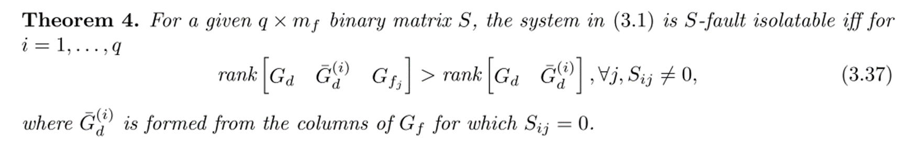

用于得到\(S\)矩阵

# GENSPEC算法原理——对应fdigenspec

## 我的简要理解（<span style="color:#FF0000;">重要</span>）

我们可以把隔离看作：只留下我想要的目标故障，而把其他的故障视为干扰。

不断应用条件判断是否可隔离



那这个算法其实就是通过不断增加要消除的故障输入的个数得到，比如

* 第一阶段：Level 0（全通滤波器）
  * **逻辑**：不强制消除任何故障，只消除系统原有的未知干扰（如果有）
  * 1     1     1     1     1     1
  * **解释**：系统存在一个滤波器，对所有 6 个输入都敏感。这是最基础的检测器，但这无法区分任何故障。
* 第二阶段：Level 1（消除 1 个输入）
  * **逻辑**：算法尝试轮流将 1 个输入当作干扰进行解耦。
  * **对应行**：那些只有 **1 个 0** 的行。
  * **结论**：系统物理结构允许我们单独屏蔽掉任何一个输入。这意味着每个输入在状态空间中都有独立的方向，不是完全共线的。
* 第三阶段：Level 2（消除 2 个输入） 
  * **逻辑**：在 Level 1 的基础上，递归尝试再多消除一个输入。即寻找能同时解耦 2 个输入的滤波器。
  * **对应行**：那些有 **2 个 0** 的行。
  * **重要观察**：并非所有“2个0”的组合都存在。例如，如果不看第1行，单看 `u1` 和 `u2` 是否能同时解耦且保留 `z_Ry`？如果矩阵里没有 `0 0 1 1 1 1` 这样的行，说明物理上无法做到“仅屏蔽 u1, u2 而保留其他所有”。

### 为什么有的组合没有出现？

你可能会问：*为什么没有一行是 `1 0 0 0 0 0`（只检测 u1，屏蔽其他所有 5 个）？*

**原因**：这是由系统的**秩条件（Rank Condition）**决定的。

* 要设计一个对 5 个输入解耦的滤波器，相当于要求左零空间向量 $q$ 满足 $q \cdot [G_{u2}, G_{u3}, G_{zZ}, G_{zRx}, G_{zRy}] = 0$。
* 如果这 5 个输入的传递函数矩阵在某些频率上是“满行秩”的（或者行数少于5），那么唯一的解可能就是 $q=0$（即不存在非零滤波器）。
* **GENSPEC 的作用**正是自动发现这些限制。如果算法递归到某一步，发现零空间为空，或者投影后的故障矩阵全为零，它就停止该分支的递归。

### 这个 S 矩阵揭示了系统的什么特性？

通过观察这个 $S$，我们可以得出关于该系统（看起来像是一个机械臂或飞行器的动力学系统）的几个关键结论：

1. **全维可观测性**：第 18 行全是 1，说明所有信号都混合在一起，没有完全无法观测的死角。
2. **单故障可隔离性强**：Level 1 的存在（那些只有一个 0 的行）说明我们可以设计出一组滤波器，每个滤波器专门对某个特定故障**不敏感**。通过组合这些滤波器（逻辑处理），我们可以精确定位是哪个故障发生了。
   * 例如：若滤波器 5 ($r_5$) 残差为 0，而其他残差非 0，则几乎可以断定是 `u1` 故障（因为只有 $r_5$ 对 `u1` 免疫）。
3. **特定的解耦群组**：
   * 观察第 10 行 `1 1 0 0 0 1`：这意味着 `u3, z_Z, z_Rx` 这三个变量在某种动力学特性上是紧密耦合的，或者可以通过某种数学变换一起被消除，从而只剩下 `u1, u2, z_Ry`。这可能对应于系统的某个物理子系统（例如横向运动与纵向运动解耦）。

### 总结

这个 $S$ 矩阵不是随机生成的，它是 GENSPEC 算法**穷举了该物理系统所有数学上成立的零空间投影方向**后得到的合集。

* 每一行是一个数学上存在的投影方向。
* 每一个 `0` 代表该方向与对应输入的列向量正交（解耦）。
* 算法保证了：**如果物理上能做到，它就会出现在这个表中；如果表中没有，说明物理上做不到。**


## **Procedure GENSPEC 算法原理详解 (基于书本 5.4 节)**

书中的 **Procedure GENSPEC** (Generation of Specifications) 是一种系统化的算法，用于自动确定一个线性系统在存在干扰的情况下，到底能够精确区分（检测和隔离）哪些故障组合。换句话说，它用于计算系统“最大可实现的故障隔离结构矩阵”（Maximally Achievable Structure Matrix, $S$）。

该算法的核心思想是**递归地利用零空间方法 (Nullspace Method)**，通过将故障集动态划分为“待检测故障”和“视为干扰的故障”，来遍历所有可能的解耦逻辑。

------

### 1. 算法背景与目标

在故障诊断中，我们通常希望设计一组残差滤波器 $Q(s)$，使得产生的残差 $r(t)$ 对特定的故障子集敏感，而对其他故障和干扰完全解耦。这种关系由**结构矩阵 $S$** 描述：

* $S_{ij} = 0$: 第 $i$ 个残差对第 $j$ 个故障**解耦**（无响应）。
* $S_{ij} = 1$: 第 $i$ 个残差对第 $j$ 个故障**敏感**（有响应）。

但在设计之前，我们往往不知道系统物理上到底支持什么样的 $S$。Procedure GENSPEC 就是用来自动生成这个 $S$ 的。

------

### 2. 核心原理：零空间与解耦

算法的数学基础是利用**左零空间 (Left Nullspace)** 来消除信号影响：

* 对于系统 $y(s) = G_d(s)d(s) + G_f(s)f(s)$，如果我们要生成一个残差 $r$，使其对干扰 $d$ 解耦，我们需要寻找一个滤波器 $Q$，使得 $Q G_d = 0$。
* 这等价于求 $G_d$ 的左零空间基 $N_L$。
* 经 $N_L$ 投影后，新系统变为 $r = N_L G_f f$。此时干扰 $d$ 已被完全消除，我们只需检查新系统 $N_L G_f$ 的列是否非零，即可判断能否检测到故障 $f$。

------

### 3. 算法步骤 (Recursive Logic)

Procedure GENSPEC 采用递归（Depth-First Search 风格）的方式来穷举所有可能的解耦组合。

#### 输入

* $G$: 系统对已知干扰的传递函数矩阵（初始为 $G_d$）。
* $F$: 系统对故障的传递函数矩阵（初始为 $G_f$）。

#### 递归过程 `S = GENSPEC(G, F)`

1. **消除当前干扰 (Compute Nullspace)**:
    计算当前干扰矩阵 $G$ 的左零空间基 $N_L$，使得 $N_L G = 0$。

   * 如果 $N_L$ 为空（即干扰太多，无法完全解耦），则说明此路径不可行，返回空。

2. **更新系统 (Project System)**:
    将故障矩阵投影到该零空间：$F_{new} = N_L F$。

   * 物理含义：此时，$F_{new}$ 描述了在完全消除干扰 $G$ 后，各故障对残差的剩余影响。

3. **评估当前规格 (Evaluate Specification)**:
    检查 $F_{new}$ 的每一列。

   * 生成一个二进制行向量 $s_{curr}$：如果 $F_{new}$ 的第 $j$ 列非零，则 $s_{curr}(j) = 1$；否则为 0。
   * 这个 $s_{curr}$ 代表了一种可实现的故障隔离模式（即在消除 $G$ 中包含的所有干扰后，还能检测到哪些故障）。

4. **递归分支 (Recursive Step)**:
    为了探索更多的隔离可能性，算法尝试将**每一个故障**轮流视为“干扰”并加入到 $G$ 中，看看剩下的故障能否被区分。

   对于 $F_{new}$ 中的每一个故障列 $f_i$ (即第 $i$ 个故障)：

   * **构造新干扰集**: 将 $f_i$ 移入干扰集。新的干扰矩阵 $G_{next} = f_i$（注意：这里是在上一层 $N_L$ 投影后的空间里操作，所以只需处理 $F_{new}$ 的列）。
   * **构造新故障集**: 剩余的故障列构成新的故障矩阵 $F_{next}$。
   * **递归调用**: `S_sub = GENSPEC(G_next, F_next)`。
   * **合并结果**: 将递归返回的子规格 $S_sub$ 拼接到总结果 $S$ 中。

5. **输出**:
    返回收集到的所有唯一且非零的结构行 $S$。

------

### 4. 算法效率与优势

* **避免暴力搜索**: 理论上，对于 $m_f$ 个故障，可能的解耦组合有 $2^{m_f}$ 种。直接暴力计算 $2^{m_f}$ 次零空间是非常昂贵的。
* **最小化计算量**: GENSPEC 利用了递归结构。每一层的零空间计算都是基于上一层降阶后的系统进行的（矩阵维度越来越小）。
* **书中提到的计算量**: 书中指出，零空间计算的次数大约与 $k_S \approx (2 m_f - 1)$ 成正比（取决于具体的秩情况），远小于暴力搜索。绝大多数计算是对单列向量进行的，非常快。

### 5. 物理意义示例

假设有3个故障 $f_1, f_2, f_3$。

1. **Level 0**: 仅消除外部干扰 $d$。得到残差 $r_0$，发现 $r_0$ 对 $f_1, f_2, f_3$ 都有响应。 -> 得到规格 `[1 1 1]`。
2. **Level 1 (递归)**:
   * 尝试消除 $f_1$（把 $f_1$ 当干扰）。计算 $N_{L1}$ 使得 $N_{L1} f_1 = 0$。
   * 应用 $N_{L1}$ 后，发现残差对 $f_2$ 有响应，对 $f_3$ 也有响应。 -> 得到规格 `[0 1 1]`（第一位是0因为 $f_1$ 被消除了）。
   * 同理尝试消除 $f_2$ -> 得到 `[1 0 1]`。
   * 同理尝试消除 $f_3$ -> 得到 `[1 1 0]`。
3. **Level 2**: 在“消除 $f_1$”的基础上，再尝试消除 $f_2$。得到规格 `[0 0 1]`。

最终，GENSPEC 会自动把这些所有可能的 `0/1` 组合（只要物理上可解耦）都找出来，形成矩阵 $S$。

### 总结

**Procedure GENSPEC** 是一个**自动化的探索工具**。它不需要工程师预先猜测“我能不能隔离故障A和故障B”，而是直接告诉工程师：“根据系统物理特性，你可以实现这些隔离逻辑（由 $S$ 给出）”。它是后续设计具体滤波器（Procedure EFDI）的前提和导航图。

1. https://ppl-ai-file-upload.s3.amazonaws.com/web/direct-files/attachments/147441806/820525ab-3c70-41c7-9bab-e379745afe39/Varga-2017-Solving-Fault-Diagnosis-Problems-Linear-Synthesis.pdf


## 举例说明

这是一次非常好的实战演练。你提供的这个 $S$ 矩阵（18行 $\times$ 6列）正是 **Procedure GENSPEC** 算法运行后的典型输出结果。

让我们通过**反推**的方式，结合 GENSPEC 的递归逻辑，来详细拆解这个矩阵是如何一步步生成的。

### 1. 矩阵解读

* **列（Columns）**：对应 6 个输入/故障源 `[u1, u2, u3, z_Z, z_Rx, z_Ry]`。
* **行（Rows）**：每一行代表一个**可实现的滤波器（残差生成器）**。
  * `0` 代表该滤波器对该输入**解耦**（无响应）。
  * `1` 代表该滤波器对该输入**敏感**（有响应）。
* **物理含义**：这个矩阵告诉我们，对于这个具体的系统，我们可以设计出 18 种不同的滤波器，每种滤波器能屏蔽掉不同的输入组合。

------

### 2. GENSPEC 算法生成过程还原

GENSPEC 算法是通过**递归地尝试将某些输入视为“干扰”并消除它们**来工作的。我们可以根据 $0$ 的分布，推测算法的递归层级。

#### 第一阶段：Level 0（全通滤波器）

* **逻辑**：不强制消除任何故障，只消除系统原有的未知干扰（如果有）。

* **对应行**：最后一行（第 18 行）。

  ```
  text
  1     1     1     1     1     1
  ```

  * **解释**：系统存在一个滤波器，对所有 6 个输入都敏感。这是最基础的检测器，但这无法区分任何故障。

#### 第二阶段：Level 1（消除 1 个输入）

* **逻辑**：算法尝试轮流将 1 个输入当作干扰进行解耦。
* **对应行**：那些只有 **1 个 0** 的行。
  * 第 5 行: `0 1 1 1 1 1` -> 能够解耦 `u1`。
  * 第 9 行: `1 0 1 1 1 1` -> 能够解耦 `u2`。
  * 第 12 行: `1 1 0 1 1 1` -> 能够解耦 `u3`。
  * 第 14 行: `1 1 1 0 1 1` -> 能够解耦 `z_Z`。
  * 第 16 行: `1 1 1 1 0 1` -> 能够解耦 `z_Rx`。
  * 第 17 行: `1 1 1 1 1 0` -> 能够解耦 `z_Ry`。
* **结论**：系统物理结构允许我们单独屏蔽掉任何一个输入。这意味着每个输入在状态空间中都有独立的方向，不是完全共线的。

#### 第三阶段：Level 2（消除 2 个输入）

* **逻辑**：在 Level 1 的基础上，递归尝试再多消除一个输入。即寻找能同时解耦 2 个输入的滤波器。
* **对应行**：那些有 **2 个 0** 的行。
  * 第 1 行: `0 0 1 1 1 0` -> 解耦 `u1` 和 `u2` (注意：此行最后一位也是0，实际上是解耦了3个，稍后分析)。
  * 第 4 行: `0 1 1 1 0 1` -> 解耦 `u1` 和 `z_Rx`。
  * ... (其他组合)
  * 第 15 行: `1 1 1 1 0 0` -> 解耦 `z_Rx` 和 `z_Ry`。
* **重要观察**：并非所有“2个0”的组合都存在。例如，如果不看第1行，单看 `u1` 和 `u2` 是否能同时解耦且保留 `z_Ry`？如果矩阵里没有 `0 0 1 1 1 1` 这样的行，说明物理上无法做到“仅屏蔽 u1, u2 而保留其他所有”。

#### 第四阶段：Level 3 及更深层（消除多个输入）

这是最有趣的部分，展示了系统的**结构约束**。

* **第 1 行**: `0 0 1 1 1 0`
  * **含义**：该滤波器同时解耦了 `u1`, `u2`, `z_Ry`。
  * **生成逻辑**：算法尝试解耦 `u1` -> 成功；在此基础上解耦 `u2` -> 成功；在此基础上解耦 `z_Ry` -> 成功。剩下的 `u3, z_Z, z_Rx` 依然能被检测到。
* **第 10 行**: `1 1 0 0 0 1`
  * **含义**：该滤波器解耦了 `u3`, `z_Z`, `z_Rx`。只对 `u1, u2, z_Ry` 敏感。

### 3. 为什么有的组合没有出现？

你可能会问：*为什么没有一行是 `1 0 0 0 0 0`（只检测 u1，屏蔽其他所有 5 个）？*

**原因**：这是由系统的**秩条件（Rank Condition）**决定的。

* 要设计一个对 5 个输入解耦的滤波器，相当于要求左零空间向量 $q$ 满足 $q \cdot [G_{u2}, G_{u3}, G_{zZ}, G_{zRx}, G_{zRy}] = 0$。
* 如果这 5 个输入的传递函数矩阵在某些频率上是“满行秩”的（或者行数少于5），那么唯一的解可能就是 $q=0$（即不存在非零滤波器）。
* **GENSPEC 的作用**正是自动发现这些限制。如果算法递归到某一步，发现零空间为空，或者投影后的故障矩阵全为零，它就停止该分支的递归。

### 4. 这个 S 矩阵揭示了系统的什么特性？

通过观察这个 $S$，我们可以得出关于该系统（看起来像是一个机械臂或飞行器的动力学系统）的几个关键结论：

1. **全维可观测性**：第 18 行全是 1，说明所有信号都混合在一起，没有完全无法观测的死角。
2. **单故障可隔离性强**：Level 1 的存在（那些只有一个 0 的行）说明我们可以设计出一组滤波器，每个滤波器专门对某个特定故障**不敏感**。通过组合这些滤波器（逻辑处理），我们可以精确定位是哪个故障发生了。
   * 例如：若滤波器 5 ($r_5$) 残差为 0，而其他残差非 0，则几乎可以断定是 `u1` 故障（因为只有 $r_5$ 对 `u1` 免疫）。
3. **特定的解耦群组**：
   * 观察第 10 行 `1 1 0 0 0 1`：这意味着 `u3, z_Z, z_Rx` 这三个变量在某种动力学特性上是紧密耦合的，或者可以通过某种数学变换一起被消除，从而只剩下 `u1, u2, z_Ry`。这可能对应于系统的某个物理子系统（例如横向运动与纵向运动解耦）。

### 总结

这个 $S$ 矩阵不是随机生成的，它是 GENSPEC 算法**穷举了该物理系统所有数学上成立的零空间投影方向**后得到的合集。

* 每一行是一个数学上存在的投影方向。
* 每一个 `0` 代表该方向与对应输入的列向量正交（解耦）。
* 算法保证了：**如果物理上能做到，它就会出现在这个表中；如果表中没有，说明物理上做不到。**

# Procedure EFDI 算法原理详解

**Procedure EFDI 算法原理详解**

Procedure EFDI (Exact Fault Detection and Isolation) 是本书用于解决 **精确故障检测与隔离问题 (EFDIP)** 的核心算法。其目标是设计一个滤波器 $Q$，使得残差信号 $r$ 的结构与预定的二进制结构矩阵 $S$ 相匹配，即：

* 如果 $S_{ij}=0$，残差 $r_i$ 对故障 $f_j$ 完全解耦；
* 如果 $S_{ij}=1$，残差 $r_i$ 对故障 $f_j$ 敏感。

该算法的核心思想是**分治法 (Divide and Conquer)**：首先通过全局解耦消除干扰，然后将复杂的 $S$ 矩阵分解为多个独立的单输出滤波器设计问题，逐一解决。

------

## **算法详细步骤**

## **Step 1: 全局干扰解耦 (Global Decoupling)**

这一步的目的是消除所有已知的干扰输入（包括控制输入 $u$ 和干扰输入 $d$），将问题转化为纯粹的故障检测问题。

1. **输入**：系统传递函数矩阵 $G(s) = [G_u(s) ; G_d(s) ; G_f(s)]$。
2. **计算左零空间**：寻找一个滤波器 $Q_1(s)$（通常取为最小左零空间基），使得它对控制和干扰输入完全解耦：
    $Q_1(s) [G_u(s) \; G_d(s)] = 0$
   * 这一步在数学上通过计算 $[G_u ; G_d]$ 的左零空间基 $N_L$ 来实现。
   * $Q_1$ 的行数通常小于系统输出数，代表了系统剩余的冗余度。
3. **系统投影**：计算消除干扰后，故障对残差的“剩余影响”：
    $R_f(s) = Q_1(s) G_f(s)$
   * 此时，新的“虚拟系统”输出只受故障影响，干扰已被完全屏蔽。

------

## **Step 2: 逐行设计 (Row-wise Synthesis)**

现在，我们要设计最终的滤波器 $Q$。由于 $S$ 的每一行代表一个独立的残差信号 $r_i$，我们可以对每一行分别设计一个标量滤波器 $q_i(s)$。

对于 $S$ 的第 $i$ 行 ($i = 1, \dots, n_b$)：

1. **定义子问题 (Problem Partitioning)**：
    根据 $S$ 的第 $i$ 行，将 $R_f$ 的列（即各个故障的影响向量）分为两组：

   * **待解耦组 ($G_{d}^i$)**：对应 $S_{ij}=0$ 的故障列。这些故障在当前残差 $r_i$ 中被视为“干扰”，必须消除。
      $G_{d}^i = \{ \text{columns of } R_f \text{ where } S_{ij} = 0 \}$
   * **待检测组 ($G_{f}^i$)**：对应 $S_{ij}=1$ 的故障列。这些故障必须在残差 $r_i$ 中保留。
      $G_{f}^i = \{ \text{columns of } R_f \text{ where } S_{ij} = 1 \}$

2. **求解子问题 (Solving Sub-problem via Procedure EFD)**：
    现在的问题变成了一个标准的 **精确故障检测问题 (EFDP)**：寻找一个标量滤波器 $Q_1^i$，使得：

   * **解耦条件**：$Q_1^i G_{d}^i = 0$（消除被视为干扰的故障）。
   * **检测条件**：$Q_1^i G_{f}^i \neq 0$（保留目标故障）。

   **Procedure EFD (Exact Fault Detection)** 被调用来解决这个问题：

   * 它再次使用零空间方法，计算 $G_{d}^i$ 的左零空间基。
   * 它会寻找阶数最低的解（Least Order Solution），以保证最终滤波器的物理实现尽可能简单。

3. **合成子滤波器**：
    第 $i$ 个残差生成器的完整形式为：
    $Q_i(s) = Q_1^i(s) Q_1(s)$

   * $Q_1(s)$ 负责消除外部干扰 $d$。
   * $Q_1^i(s)$ 负责消除不需要的故障 $f_{subset}$。

------

## **Step 3: 总体合成 (Final Assembly)**

将所有行设计好的子滤波器 $Q_i(s)$ 堆叠起来，构成最终的矩阵滤波器 $Q(s)$：
 $Q(s) = \begin{bmatrix} Q_1(s) \\ Q_2(s) \\ \vdots \\ Q_{n_b}(s) \end{bmatrix}$

* 最终的残差向量为 $r(s) = Q(s) y(s)$。
* 由于每个 $Q_i$ 都满足了 $S$ 对应行的逻辑，$r$ 将精确地反映结构矩阵 $S$ 的故障隔离特性。

------

## **直观理解**

想象你在设计一个安检系统（Procedure EFDI）：

1. **全局解耦**：首先安装一个金属探测门（$Q_1$），排除所有非金属物品（干扰 $d$）的影响。现在只剩下金属物品（故障 $f$）会触发信号。
2. **逐行设计**：
   * **目标 1**：区分硬币（$f_1$）和钥匙（$f_2$）。设计一个专门针对圆形的检测器（$Q_1^1$），它对形状不规则的钥匙无反应（解耦），但对硬币有反应（检测）。
   * **目标 2**：区分手机（$f_3$）和硬币。设计一个针对大块金属的检测器（$Q_1^2$），它对小硬币无反应，对手机有反应。
3. **结果**：将这些特定检测器组合在一起，你就能通过查看哪盏灯亮了，精确判断通过的是硬币、钥匙还是手机。

## **为什么这个算法强大？**

* **通用性**：它不依赖于具体的物理模型结构，只要系统是线性的，就能通过矩阵运算自动解出。
* **最优性**：在每一步子问题求解中，都使用了最小阶设计（Least Order Synthesis），保证了最终得到的滤波器是数学上最简洁的。
* **灵活性**：它将复杂的隔离问题拆解为简单的检测问题，使得算法数值稳定性极高。

1. https://ppl-ai-file-upload.s3.amazonaws.com/web/direct-files/attachments/147441806/eff6e183-dc58-4bb6-9978-48d96f4dbe8c/Varga-2017-Solving-Fault-Diagnosis-Problems-Linear-Synthesis.pdf