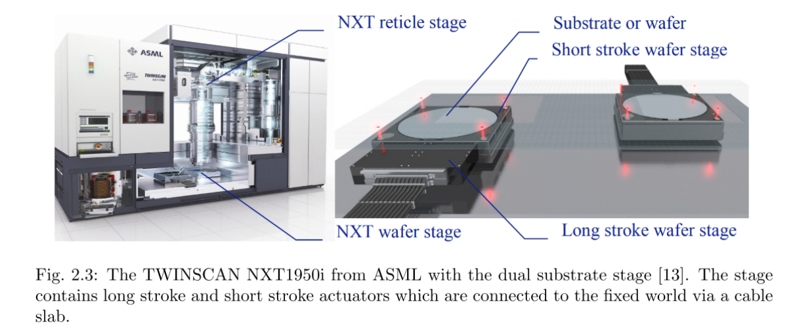
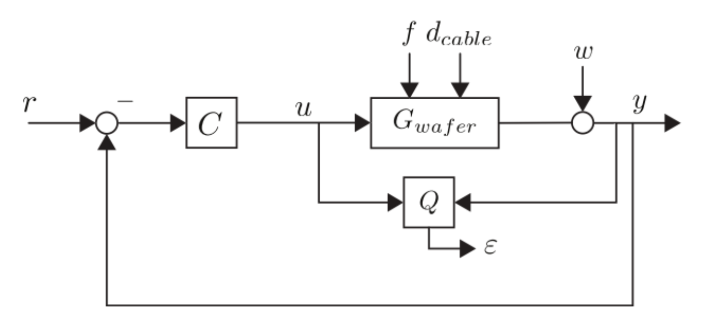
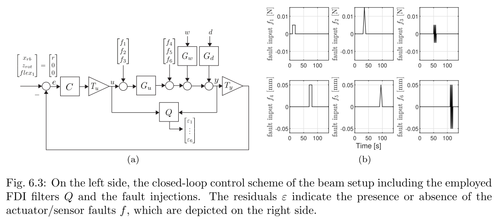
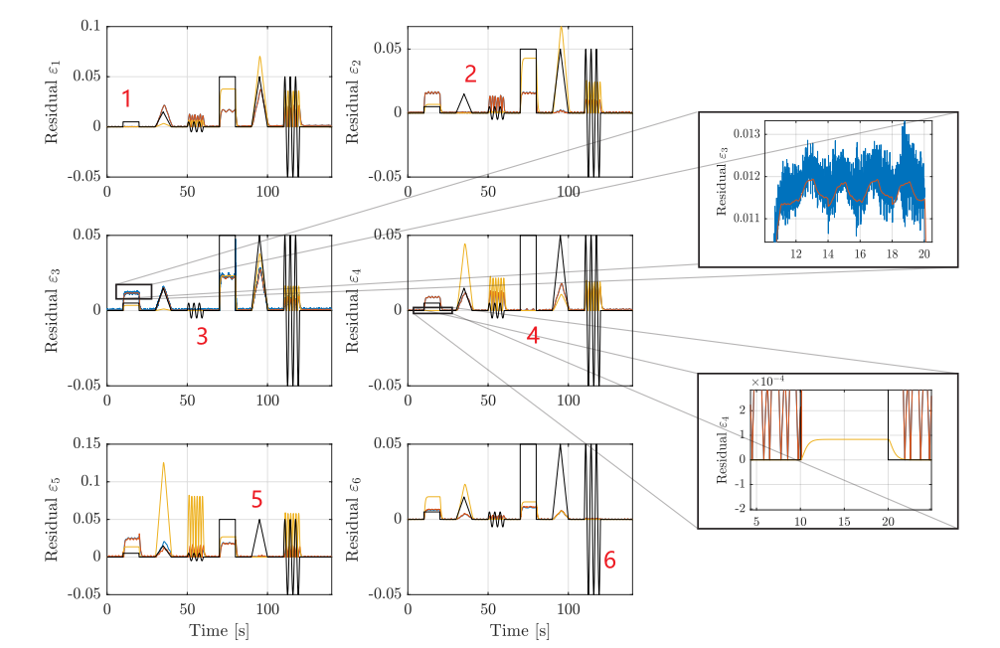
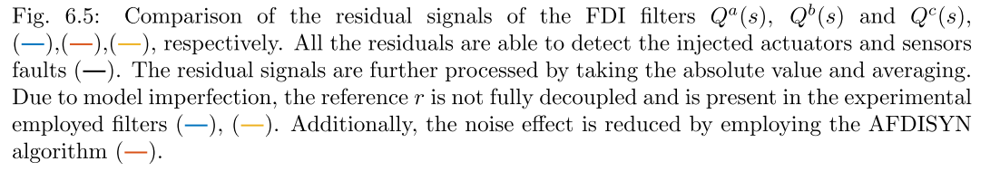
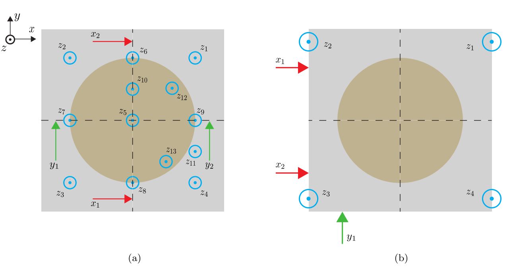
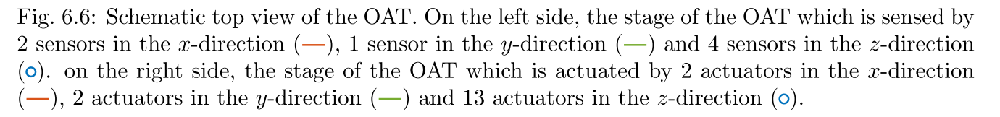
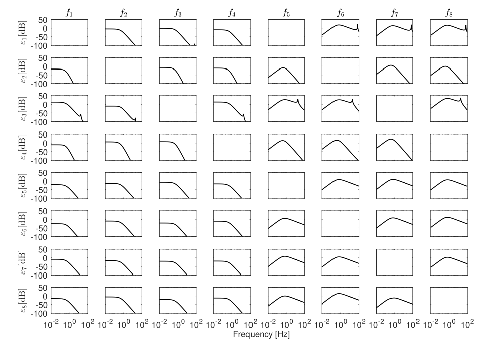

本文的大纲如下：第2章阐述问题的公式化表述。第3章介绍基于零空间的故障诊断理论。第4章描述基于零空间的方法在高精度系统中的设计自由度和局限性。第5章给出有效进行基于模型的故障诊断所需的模型要求。第6章研究两个案例。在第一个案例中，采用基于零空间的故障诊断方法来检测和定位注入高精度系统的多个执行器和传感器故障。在第二个案例中，采用基于零空间的故障诊断方法来处理高精度系统中子模块之间的干扰。最后，第7章给出结论和建议。

# 梳理思路逻辑

最终目的：找到一个\( Q(\lambda):=[Q_{y}(\lambda) \ Q_{u}(\lambda)] \)，其中\(\lambda= s或者\lambda=  z\)，通过处理传感器信号\(y(\lambda)\)和控制输入\(u(\lambda)\)得到残差信号\(\varepsilon(\lambda)\)

## \(Q(\lambda)\)解耦的数学本质是\(G(\lambda)\)的左零空间

使其满足：

##### 粗略的来说，是：

1. $$\varepsilon(\lambda) \approx 0, \text{ 当 } f(\lambda) = 0,$$
2. $$\varepsilon(\lambda) \neq 0, \text{ 当 } f(\lambda) \neq 0, \tag{3.3}$$


其中
$$
\varepsilon(\lambda) = Q(\lambda) 
\begin{bmatrix}
y(\lambda) \\
u(\lambda)
\end{bmatrix} 
= Q_y(\lambda)y(\lambda) + Q_u(\lambda)u(\lambda) \tag{3.2}
$$
其中 $y(\lambda)$ 可以表示为：

$$
y(\lambda) = G_u(\lambda)u(\lambda) + G_d(\lambda)d(\lambda) + G_w(\lambda)w(\lambda) + G_f(\lambda)f(\lambda) \tag{3.1}
$$
维度： $y(\lambda)$ ——\(p\)维、 $u(\lambda)$ ——\(m_u\)维、 $d(\lambda)$ ——\(m_d\)维、 $w(\lambda)$ ——\(m_w\)维、 $f(\lambda)$ ——\(m_f\)维


将\(y(\lambda)\)代入\(\varepsilon(\lambda)\)​表达式，则滤波器的内部形式可表示为
$$
\varepsilon(\lambda) = R_u(\lambda)u(\lambda) + R_d(\lambda)d(\lambda) + R_w(\lambda)w(\lambda) + R_f(\lambda)f(\lambda), \tag{3.4}
$$
其中 $R_u(\lambda), R_d(\lambda), R_w(\lambda)$ 和 $R_f(\lambda)$ 通过下式获得：
\[
[R_u(\lambda) \mid R_d(\lambda) \mid R_w(\lambda) \mid R_f(\lambda)] = Q(\lambda) 
\begin{bmatrix} 
G_u(\lambda) \\ 
I 
\end{bmatrix} 
\begin{bmatrix} 
G_d(\lambda) \\ 
0 
\end{bmatrix} 
\begin{bmatrix} 
G_w(\lambda) \\ 
0 
\end{bmatrix} 
\begin{bmatrix} 
G_f(\lambda) \\ 
0 
\end{bmatrix}. \tag{3.5}
\]
**注记.** 式(3.4)中给出的滤波器内部形式也适用于闭环系统[14]。


##### 精确的来说，是：

故障检测滤波器 $Q(\lambda)$ 必须满足以下条件：解耦条件(i, ii)、故障输入的检测条件(iii)和噪声输入的衰减条件(iv)：

1. (i) $R_u(\lambda) = 0$,
2. (ii) $R_d(\lambda) = 0$,
3. (iii) $R_{f_j}(\lambda) \neq 0 \, j = 1, \ldots, m_f$,
4. (iv) $R_w(\lambda) \approx 0$。


<span style="color:#FF0000;">？？？</span>为满足各个条件，使用式(3.6)中的因子化表示
$$
Q(\lambda) = Q_K(\lambda) \ldots Q_2(\lambda)Q_1(\lambda)\tag{3.6}
$$
其中每个 $ Q_i(\lambda) $ 在实现这些条件中具有特定功能。故障检测问题分为精确故障检测问题(EFDP)或近似故障检测问题(AFDP)，并扩展到故障检测与隔离问题(FDIP)，这些将在3.2-3.4节中描述。


$$
G(\lambda)=[G_u(\lambda) \ G_d(\lambda) \ G_w(\lambda) \ G_f(\lambda)]
$$
求
$$
\varepsilon(\lambda) = Q(\lambda)\begin{bmatrix}
G_u(\lambda)u(\lambda) + G_d(\lambda)d(\lambda) + G_w(\lambda)w(\lambda) + G_f(\lambda)f(\lambda) \\
u(\lambda)
\end{bmatrix}
$$
也即
$$
\varepsilon(\lambda) =
Q(\lambda)
\left[ \begin{array}{c|c} G_u(\lambda) & G_d(\lambda) \ \ G_w(\lambda)\ \ G_f(\lambda)\\ \hline I & 0 \end{array} \right]
\begin{bmatrix} u(\lambda)  \\ d(\lambda) \\ w(\lambda)  \\ f(\lambda)\end{bmatrix}
$$


为了设计一个滤波器 $Q(\lambda)$，使得生成的残差信号 $r$ 对已知的控制输入 $u$ 、未知的干扰 $d$ 、噪声\(w\)完全解耦（即不敏感），同时对故障 $f$ 保持敏感 。

则需要
$$
Q(\lambda)
\left[ \begin{array}{c|c} G_u(\lambda) & G_d(\lambda) \ \ G_w(\lambda)\\ \hline I & 0 \end{array} \right]
\begin{bmatrix} u(\lambda)  \\ d(\lambda) \\ w(\lambda)
\end{bmatrix}=0
$$

$$
由于\begin{bmatrix} u(\lambda)  \\ d(\lambda) \\ w(\lambda)
\end{bmatrix}不是恒为零向量，因为控制输入u，扰动d和噪声w都不恒为0
$$

因此需要其左乘的矩阵为0矩阵，才能保证二者相乘恒为0，即
$$
Q(\lambda)
\left[ \begin{array}{c|c} G_u(\lambda) & G_d(\lambda) \ \ G_w(\lambda)\\ \hline I & 0 \end{array} \right]
=0
$$
定义$G(\lambda) := \left[ \begin{array}{c|c} G_u(\lambda) & G_d(\lambda) \ \ G_w(\lambda)\\ \hline I_{m_u} & 0 \end{array} \right]$，则故障解耦问题的数学本质就是寻找矩阵\(G(\lambda)\)的左零空间。

> 此故障诊断中的\(G(\lambda)= \left[ \begin{array}{c|c} G_u(\lambda) & G_d(\lambda) \ \ G_w(\lambda)\\ \hline I & 0 \end{array} \right]\)非彼控制理论中的\(G(\lambda)=Y(\lambda)/U(\lambda)\)

> 在控制理论中，我们通常将 $G(\lambda)$ 理解为传递函数，即 **输出 $Y(\lambda)$ 除以输入 $U(\lambda)$**，但是这里**不是系统的传递函数矩阵**，它是为了将故障解耦的约束条件转化为**线性代数问题**而**特别构造出来的增广矩阵**。
>
> 在故障诊断文献中，这个矩阵通常被称为：
>
> 1. **约束矩阵 (Constraint Matrix)**
> 2. **增广系统矩阵 (Augmented System Matrix)**
> 3. **解耦矩阵 (Decoupling Matrix)**
>
> 它的作用是：**将所有需要被解耦的输入（$u$ 和 $d$）的动力学特性打包在一起，并加上一个特殊的代数行，以便让滤波器 $Q(\lambda)$ 能够将它们“湮灭”掉。**


## 如何找到\(G(\lambda)\)的左零空间


目标是找到一个左最小基矩阵 $N_l(\lambda)$，使得它与系统矩阵 $G(\lambda)$ 相乘为零，即 $N_l(\lambda)G(\lambda) = 0$。

### 数值可靠性对比：有理函数矩阵表示  VS  状态空间表示

#### 为什么直接对有理函数矩阵进行运算（多项式操作）在数值上是不可靠的？

首先，我们明确一下对象：一个有理函数矩阵，例如传递函数矩阵 **G(s)**，通常表示为两个多项式矩阵的比值：

**G(s) = N(s) / d(s)** （对于SISO系统）
或
**G(s) = D(s)⁻¹ * N(s)** （对于MIMO系统，其中 **D(s)** 和 **N(s)** 是多项式矩阵）

所谓“直接进行多项式操作”，指的是在计算机中直接存储和处理这些多项式的系数，并进行如求根、求最大公因式、计算行列式、求逆等运算。

这种方法的数值不可靠性主要源于以下几个相互关联的根本原因：

---

##### 1. 多项式求根的极端敏感性（Wilkinson 问题）

这是最核心、最致命的问题。

*   **问题的本质**：多项式的根对于其系数的微小扰动极其敏感。特别是对于高阶多项式，系数的一个微不足道的改变（比如在计算机的舍入误差范围内）都可能导致根的完全改变。
*   **经典例子**：威尔金森多项式。
    考虑一个看似简单的多项式，其根为 1, 2, 3, ..., 20：
    `P(x) = (x-1)(x-2)...(x-20) = x²⁰ - 210x¹⁹ + ...`
    如果我们将 `x¹⁹` 的系数从 -210 改变一个极小的量，变为 `-210 + 2⁻²³`（这大约是 IEEE 双精度浮点数的精度级别），你会发现一些根变得面目全非，甚至出现了严重的虚部。原本是实根，现在变成了复根。
*   **在有理函数矩阵中的体现**：
    *   **极点/零点计算**：要分析系统的稳定性（极点）和性能（零点），我们需要计算分母和分子多项式的根。直接对系数构成的多项式求根，结果可能完全错误，尤其是当系统阶数较高时。
    *   **公共因子**：在MIMO系统中，**D(s)** 和 **N(s)** 可能由于建模近似而存在数值上的“近似的”公共因子。直接操作可能会错误地消去这些因子，或者因为数值误差而引入虚假的、不稳定的极点零点对。

##### 2. 病态的多项式运算

即使不直接求根，对多项式系数本身进行的一系列运算也可能是病态的。

*   **多项式乘法（卷积）**：在状态空间模型中，系统的串联对应于状态矩阵的复杂组合。但在多项式表示中，系统的串联对应于多项式相乘。两个多项式相乘会加剧系数值的动态范围。高阶项的系数可能非常大，而低阶项的系数可能非常小。当这些大小差异悬殊的数在计算机中相加时，会加剧舍入误差，导致有效数字的丢失。
*   **行列式计算**：要计算传递函数矩阵的行列式（例如用于求特征多项式或MIMO零点），我们需要计算一个多项式矩阵的行列式，其结果是一个多项式。这个计算过程涉及大量的加法和乘法，是数值误差的温床。
*   **求最大公因式（GCD）**：在简化传递函数或检查能控性/能观性时，理论上需要求GCD。然而，数值上判断两个多项式是否“精确”地拥有一个公因子是不可能的。由于舍入误差的存在，它们总是“近似”地有公因子。判断“近似”到什么程度可以接受，是一个非常困难且没有通用标准的问题。

##### 3. 动态范围与系数缩放问题

一个高阶系统的传递函数，其系数可能跨越巨大的数量级。

*   **示例**：一个特征值为 `[1, 10, 100, 1000, ...]` 的系统，其特征多项式的系数会从常数项到最高阶项相差几十个数量级。
*   **计算机表示问题**：在浮点数表示中（如双精度），虽然可以表示非常大和非常小的数，但当你试图将一个极大数和一个极小数相加时，由于精度有限，极小数可能被“淹没”，其贡献完全丢失。这在进行多项式求值或运算时是常见问题。

##### 4. 可控/可观标准型的病态性

在状态空间实现中，有一种特殊的形式叫做可控标准型或可观标准型，它是直接由传递函数的系数构成的。

*   **结构**：对于一个 n 阶 SISO 系统，其可控标准型为：
    ```
    A = [ 0      1      0     ...   0
          0      0      1     ...   0
          ...    ...    ...   ...   ...
         -a₀    -a₁    -a₂    ...  -aₙ₋₁ ]
    B = [0, 0, ..., 1]ᵀ
    C = [b₀, b₁, ..., bₙ₋₁]
    D = bₙ
    ```
    其中 `aᵢ` 和 `bᵢ` 就是分母和分子多项式的系数。
*   **为什么病态**：这个 **A** 矩阵的特征值（即系统的极点）就是分母多项式的根。正如第一点所述，这些根对 `aᵢ` 的微小变化极其敏感。因此，基于病态多项式系数构建的状态空间模型本身也是病态的。任何基于此模型的后续计算（如仿真、控制器设计）都将是不可靠的。

---

#### 更优的替代方案：状态空间表示

现代控制理论和数值软件（如 MATLAB 的 Control System Toolbox）普遍推荐并使用**状态空间表示**来解决上述问题。

状态空间模型形式为：

```
ẋ = Ax + Bu
y = Cx + Du
```

**为什么状态空间表示在数值上更可靠？**

1.  **解耦与平衡**：在状态空间表示中，系统的动态特性被编码在矩阵 **A** 中。通过使用数值稳定的算法（如 **QR 算法**）直接计算矩阵 **A** 的特征值，可以避免从多项式系数求根的问题。矩阵特征值问题通常比多项式求根问题**条件好得多**。
2.  **相似变换**：我们可以对状态空间模型进行**平衡**，这是一个相似变换，使得状态矩阵 **A** 的行和列范数尽可能相等。这大大改善了后续数值计算（如特征值分解）的条件数。
3.  **避免多项式运算**：状态空间模型下的系统互联（串联、并联、反馈）都有对应的、数值上稳定的矩阵运算公式，完全绕开了不稳定的多项式卷积运算。
4.  **保留物理意义**：状态变量通常对应于系统中可测量的物理量（或它们的线性组合），这使得模型更直观，也更容易进行模型降阶等操作。

##### 总结

直接对有理函数矩阵进行多项式操作在数值上不可靠，其根本原因在于：

*   **核心病态**：多项式求根对其系数的微小扰动具有极端敏感性。
*   **运算病态**：多项式乘法、行列式计算等过程会放大数值误差。
*   **表示问题**：多项式系数的巨大动态范围在有限精度的计算机算术中会导致有效数字丢失。

因此，在工程实践中，对于任何严肃的分析和设计，都应**尽量避免直接处理传递函数的系数**。取而代之的是，应使用**状态空间模型**，并依赖为此模型设计的、成熟的数值线性代数算法，这样才能获得可靠和准确的结果。软件工具（如 MATLAB）在内部处理传递函数时，也常常会先将其转换为状态空间形式进行计算。

#### 为什么状态空间表示在数值上更可靠？

好的，这是一个非常深刻且重要的问题。我们将沿着与“多项式表示不可靠”的对比思路，详细拆解为什么状态空间表示在数值上更为可靠。

核心原因在于：**状态空间表示将问题从“病态”的多项式运算领域，转移到了“相对良态”的数值线性代数领域，并提供了通过相似变换来改善问题本身条件的强大工具。**

下面我们从几个关键维度进行详细解释。

##### 1. 根本优势：特征值问题 vs. 多项式求根

这是最根本、最重要的区别。

*   **状态空间（特征值问题）**：
    系统的动力学特性（极点）由状态矩阵 **A** 的特征值决定。计算特征值需要求解：
    `det(λI - A) = 0`
    数值计算中，这并非通过计算行列式多项式再求根来实现的。而是使用极其稳定的迭代算法，如 **QR 算法**。该算法通过对矩阵 **A** 进行一系列正交相似变换（**QR 分解**），将其逐步化为**舒尔形式**（上三角矩阵或分块上三角矩阵），其特征值就直接出现在对角线上了。

    **为什么稳定？**
    1.  **正交变换是数值稳定的**：正交矩阵的条件数为1，用它进行相似变换不会放大误差。
    2.  **直接操作矩阵元素**：QR算法直接处理矩阵 **A** 的元素，避免了生成高阶多项式系数这一中间步骤，从而绕开了多项式求根的敏感性陷阱。

*   **多项式表示（多项式求根）**：
    如前所述，它要求我们从一个极度敏感的多项式 `sⁿ + aₙ₋₁sⁿ₋¹ + ... + a₁s + a₀` 的系数出发，去计算其根。这是一个**先天病态**的问题。

**类比**：想象一下，状态空间方法就像是通过精密仪器直接测量一个物体的属性（如重量、体积）。而多项式方法则是先根据一个极其复杂的公式估算出这些属性，再进行计算。后者在每一步都会引入误差，并且公式本身对初始估算的微小误差极为敏感。

##### 2. 核心工具：相似变换与平衡（Balancing）

这是状态空间方法独有的、强大的“武器库”，可以主动改善问题的数值条件。

*   **相似变换的威力**：
    对于状态空间模型 `(A, B, C, D)`，我们可以进行**相似变换**，将其转换为另一个等价的模型 `(T⁻¹AT, T⁻¹B, CT, D)`。这两个模型具有相同的输入-输出特性（相同的传递函数）和相同的特征值。
    这意味着，如果我们找到了一个合适的非奇异矩阵 **T**，就可以将一个“坏”的 **A** 矩阵，变换成一个“好”的、更适合数值计算的 **A'** 矩阵。

*   **平衡（Balancing）**：
    这是一种特殊的、自动化的相似变换。其目标是找到一个变换矩阵 **T**，使得变换后的状态矩阵 **A'** 的行范数和列范数尽可能相等。
    **为什么这很重要？**
    如果一个状态变量的量级（或能量）与其他变量相差悬殊（例如 `x₁` 的范围是 `10⁻⁶` 到 `10⁻⁶`，而 `x₂` 的范围是 `10⁶` 到 `10⁶`），那么矩阵 **A** 中相应的行和列也会存在巨大的数量级差异。这种“缩放不当”的矩阵在数值运算中会非常病态，因为计算机浮点运算会“淹没”那些小量级的贡献。
    **平衡**过程通过缩放状态变量，消除了这种数量级上的巨大差异，从而**显著降低了矩阵的条件数**，使得后续的特征值计算等操作更加精确可靠。

**对比**：多项式表示完全没有这种“自我优化”的能力。一旦多项式系数被确定，其病态性就固定了，无法通过等价变换来改善。

##### 3. 系统互联运算的稳定性

在构建复杂系统时，我们需要进行子系统间的串联、并联和反馈连接。

*   **状态空间下的互联**：
    这些操作都有对应的、基于矩阵拼接和运算的精确公式。例如，两个子系统反馈连接，其闭环系统的状态矩阵可以通过求解一个**代数Riccati方程**或使用其他基于矩阵分解的稳定算法得到。这些运算都是在数值线性代数的框架内完成的，是良态的。

*   **多项式/传递函数下的互联**：
    串联对应着多项式**乘法（卷积）**，反馈连接涉及更复杂的多项式乘法和加法。正如之前所述，多项式乘法会急剧扩大系数的动态范围，并积累舍入误差，导致有效数字丢失。

##### 4. 规避“可控/可观标准型”的病态

我们之前提到，由传递函数系数直接构建的**可控标准型**是极度病态的。

*   **状态空间表示的灵活性**：
    状态空间表示不是唯一的。除了病态的可控标准型，我们可以通过相似变换，将系统转化为其他各种数值上优越的**典范形式**。例如：
    *   **舒尔分解（Schur Decomposition）**：可以将 **A** 矩阵化为上三角形式，特征值一目了然。
    *   **海森伯格形式（Hessenberg Form）**：是QR算法中一个理想的中间步骤，它比一般稠密矩阵计算效率更高、更稳定。
    *   **模型降阶技术**：如平衡截断（Balanced Truncation），它基于系统的能控性和能观性格拉姆矩阵，可以安全地移除对输入输出行为影响最小的状态，而这个过程在多项式领域是难以实现的。

##### 总结对比表

| 特性         | 多项式/传递函数表示           | 状态空间表示                                 |
| :----------- | :---------------------------- | :------------------------------------------- |
| **核心计算** | 多项式求根                    | 矩阵特征值分解（如QR算法）                   |
| **数值条件** | **先天病态**（Wilkinson问题） | **相对良态**，可通过算法保证稳定             |
| **问题优化** | 无法改善自身条件              | 可通过**相似变换**和**平衡**主动改善条件数   |
| **系统互联** | 多项式乘/加，易积累误差       | 矩阵运算，数值稳定                           |
| **实现形式** | 基本唯一（系数决定）          | **高度灵活**，可转换为多种数值稳定的典范形式 |
| **适用场景** | 低阶、简单系统的理论分析      | 中高阶、复杂系统的**实际数值计算**与控制设计 |

**结论**：

状态空间表示在数值上更可靠，并非因为它本身天生完美，而是因为它**将问题置于一个更强大、更成熟的数学框架之下——数值线性代数**。在这个框架内，我们拥有像QR算法、相似变换、矩阵分解等一整套经过千锤百炼的数值工具。这些工具允许我们不仅被动地计算，还能主动地**重构和优化问题本身**，使其变得更容易被计算机精确求解。

因此，对于任何严肃的工程应用、仿真和高阶系统的分析与设计，状态空间表示都是事实上的标准和不二之选。


### 描述符系统：一种基于状态空间的数值稳定运算方法求左零空间

论文指出，直接对有理函数矩阵进行运算（多项式操作）在数值上是不可靠的。因此，论文采用了一种基于**状态空间**或**描述符系统（Descriptor Systems）**表示的方法，利用正交相似变换来保证数值稳定性。

该方法的核心逻辑利用了一个数学事实：$N_l(\lambda)$ 是 $G(\lambda)$ 的零空间基，当且仅当 $[\begin{smallmatrix} M_l(\lambda) & N_l(\lambda) \end{smallmatrix}]$ 是系统矩阵 $S(\lambda)$ 的左零空间 5。

#### 目标是找到左零空间基\(N_{l}(\lambda)\)

目标是找到一个满行秩的真有理矩阵 $N_l(\lambda)$（即左零空间基），使得：
$$
N_l(\lambda) G(\lambda) = 0
$$

#### 方法：先求 $S(\lambda)$ 的左零空间，再从中提取$N_l(\lambda)$

solving varga书：184面和348面

Varga 方法的核心思想是将“寻找有理矩阵 $G(\lambda)$ 的零空间”转化为“寻找其**系统矩阵（System Matrix）** $S(\lambda)$ 的零空间”。

假设 $G(\lambda)$ 有一个描述符系统实现（Descriptor System Realization）$(A-\lambda E, B, C, D)$：
$$
G(\lambda) = C(\lambda E - A)^{-1}B + D
$$
与之关联的系统矩阵 $S(\lambda)$ 定义为：
$$
S(\lambda) = \begin{bmatrix} A - \lambda E & B \\ C & D \end{bmatrix}
$$
关键关系：

$N_l(\lambda)$ 是 $G(\lambda)$ 的左零空间基，当且仅当存在一个合适的 $M_l(\lambda)$，使得 $Y_l(\lambda) := [M_l(\lambda) \quad N_l(\lambda)]$ 是系统矩阵 $S(\lambda)$ 的左零空间基。即：
$$
[M_l(\lambda) \quad N_l(\lambda)] \begin{bmatrix} A - \lambda E & B \\ C & D \end{bmatrix} = 0
$$
因此，计算步骤转化为先求 $S(\lambda)$ 的左零空间，再从中提取 $N_l(\lambda)$。

#### 为什么可以通过求 $S(\lambda)$ 的左零空间得到$N_l(\lambda)$

这一转化的核心在于利用**系统矩阵（System Matrix）** $S(\lambda)$ 与**传递函数矩阵** $G(\lambda)$ 之间的代数等价关系。通过这种转化，可以将复杂的有理函数矩阵运算（数值不稳定）转换为针对线性矩阵束（Matrix Pencil）的运算（数值稳定）。

即解释为什么：$N_l(\lambda)$ 是 $G(\lambda)$ 的左零空间基，**当且仅当**存在一个合适的 $M_l(\lambda)$，使得 $Y_l(\lambda) := [M_l(\lambda) \quad N_l(\lambda)]$ 是系统矩阵 $S(\lambda)$ 的左零空间基 。

根据 Andreas Varga 的著作《Solving Fault Diagnosis Problems: Linear Synthesis Techniques》，以下是详细的数学推导和逻辑解释：


##### 1. 定义基础变量

首先，我们需要明确 $G(\lambda)$ 和 $S(\lambda)$ 的定义及其关系：

* 传递函数矩阵 $G(\lambda)$：

  假设系统有一个描述符状态空间实现（Descriptor System Realization）$(A-\lambda E, B, C, D)$，其传递函数定义为：

  $$G(\lambda) = C(\lambda E - A)^{-1}B + D$$

* 系统矩阵 $S(\lambda)$：

  与之对应的系统矩阵（也称为 Rosenbrock 系统矩阵）定义为：

  $$S(\lambda) = \begin{bmatrix} A - \lambda E & B \\ C & D \end{bmatrix}$$

##### 2. 建立零空间关系的推导


我们的目标是寻找 $G(\lambda)$ 的左零空间基 $N_l(\lambda)$，即满足：


$$N_l(\lambda)G(\lambda) = 0$$

书中指出利用了一个简单的数学事实：$N_l(\lambda)$ 是 $G(\lambda)$ 的左零空间基，**当且仅当**存在一个合适的 $M_l(\lambda)$，使得 $Y_l(\lambda) := [M_l(\lambda) \quad N_l(\lambda)]$ 是系统矩阵 $S(\lambda)$ 的左零空间基 3。


**详细推导逻辑如下：**

假设我们要寻找 $S(\lambda)$ 的左零空间向量 $Y_l(\lambda)$，将其分块为 $[M_l(\lambda) \quad N_l(\lambda)]$，则有：


$$[M_l(\lambda) \quad N_l(\lambda)] \begin{bmatrix} A - \lambda E & B \\ C & D \end{bmatrix} = 0$$

4


将上述矩阵乘法展开，我们可以得到两个联立方程：

1. $M_l(\lambda)(A - \lambda E) + N_l(\lambda)C = 0$
2. $M_l(\lambda)B + N_l(\lambda)D = 0$

步骤 A：从方程 (1) 中解出 $M_l(\lambda)$

注意到 $A - \lambda E = -(\lambda E - A)$，我们可以将方程 (1) 重写为：


$$M_l(\lambda)[-(\lambda E - A)] + N_l(\lambda)C = 0$$

$$M_l(\lambda)(\lambda E - A) = N_l(\lambda)C$$


由此可得 $M_l(\lambda)$ 与 $N_l(\lambda)$ 的关系（在 $(\lambda E - A)$ 可逆处）：


$$M_l(\lambda) = N_l(\lambda)C(\lambda E - A)^{-1}$$

步骤 B：代入方程 (2)

将步骤 A 得到的 $M_l(\lambda)$ 表达式代入方程 (2) $M_l(\lambda)B + N_l(\lambda)D = 0$ 中：


$$[N_l(\lambda)C(\lambda E - A)^{-1}]B + N_l(\lambda)D = 0$$

提取公因式 $N_l(\lambda)$：


$$N_l(\lambda) \left[ C(\lambda E - A)^{-1}B + D \right] = 0$$

步骤 C：识别传递函数

观察方括号内的项 $C(\lambda E - A)^{-1}B + D$，这正是 $G(\lambda)$ 的定义 5。

因此，上述方程等价于：


$$N_l(\lambda)G(\lambda) = 0$$


##### 3. 逻辑总结


这个推导证明了两者之间的等价性：

* 如果你找到了 $S(\lambda)$ 的左零空间基 $Y_l(\lambda) = [M_l(\lambda) \quad N_l(\lambda)]$，那么该向量的**后半部分** $N_l(\lambda)$ 必然是 $G(\lambda)$ 的左零空间基。
* $M_l(\lambda)$ 起到了“桥梁”的作用，它联系了系统的内部状态动态与输出方程。


##### 4. 这种转化的核心优势


Varga 在书中强调这种转化是开发数值可靠算法的基础 6：


1. **避免符号运算**：直接对 $G(\lambda)$（有理函数矩阵）求零空间需要复杂的多项式运算，极易产生数值误差。

2. 

   **利用正交变换**：转化后的问题变成了对线性矩阵束 $S(\lambda)$ 的操作。我们可以使用正交变换（如 SVD 或 QR 分解）将 $S(\lambda)$ 转换为 **Kronecker-like 阶梯形式**，从而在数值稳定的前提下直接读取出 $N_l(\lambda)$ 的状态空间实现参数 7。

   

   


#### 详细计算步骤（算法流程）

Varga 在书中（第 7.4 节和 10.3.2 节）详细描述了通过正交变换来实现这一过程的算法，该算法保证了数值稳定性。

##### 第一步：构建 Kronecker-like 阶梯形式


使用正交变换矩阵 $U$ 和 $V$（书中有些章节记为 $Q$ 和 $Z$），将系统矩阵 $S(\lambda)$ 压缩为 Kronecker-like 阶梯形式。

通过算法（如 PREDUCE 过程 4），可以找到 $U$ 和 $V$ 使得：


$$\bar{S}(\lambda) = U S(\lambda) V = \begin{bmatrix} A_r - \lambda E_r & * & * \\ 0 & A_l - \lambda E_l & * \\ 0 & 0 & C_l \end{bmatrix}$$


其中：

* $A_r - \lambda E_r$ 具有满行秩。

* 

  $(A_l - \lambda E_l, C_l)$ 是可观测的描述符对 55。

  

  


##### 第二步：确定 $\bar{S}(\lambda)$ 的左零空间


对于变换后的阶梯形式 $\bar{S}(\lambda)$，可以显式写出一个左零空间基 $\bar{Y}_l(\lambda)$：


$$\bar{Y}_l(\lambda) = \begin{bmatrix} 0 & C_l(\lambda E_l - A_l)^{-1} & I \end{bmatrix}$$

这个形式利用了 $\bar{S}(\lambda)$ 的下三角块结构 66。


##### 第三步：逆变换回原坐标系


原系统矩阵 $S(\lambda)$ 的左零空间 $Y_l(\lambda)$ 可以通过逆变换得到：


$$Y_l(\lambda) = \bar{Y}_l(\lambda) U$$


我们需要对正交矩阵 $U$ 进行分块，使其与 $\bar{Y}_l(\lambda)$ 的列结构相匹配。假设 $U$ 分块为：


$$U = \begin{bmatrix} * & * \\ B_l & * \\ D_l & * \end{bmatrix}$$


（注：这里的行对应于 $\bar{Y}_l$ 的列结构，具体对应于 $S(\lambda)$ 中的状态方程部分和输出方程部分）。


##### 第四步：提取 $N_l(\lambda)$


根据公式 $N_l(\lambda) = Y_l(\lambda) \begin{bmatrix} 0 \\ I \end{bmatrix}$ 7777，我们只需要 $Y_l(\lambda)$ 对应于 $S(\lambda)$ 下半部分（即 $C, D$ 行）的分量。

代入计算后，得到 $N_l(\lambda)$ 的状态空间实现为 8888：


$$N_l(\lambda) = \left[ \begin{array}{c|c} A_l - \lambda E_l & B_l \\ \hline C_l & D_l \end{array} \right] = C_l(\lambda E_l - A_l)^{-1}B_l + D_l$$


##### 4. 结果的性质


通过上述方法得到的 $N_l(\lambda)$ 具有以下重要性质：

1. 

   **最小性（Minimal）**：如果原系统 $G(\lambda)$ 的实现是可控的，则上述得到的 $N_l(\lambda)$ 是**最小**真有理基（即具有最小的麦克米伦度/阶数）9999。

   

   

2. **真有理性（Proper）**：结果是一个真有理传递函数矩阵。

3. 

   **数值稳定性**：整个过程只使用了正交变换（SVD, QR分解等），避免了多项式方法中常见的数值病态问题 10。

   

   

4. 

   **任意极点配置**：可以通过输出注入（Output Injection）技术，将 $N_l(\lambda)$ 的极点配置在复平面的稳定区域，从而得到稳定的故障检测滤波器 11111111。

   

   


### 总结


Varga 书中寻找 $G(\lambda)$ 左零空间的逻辑是：

1. 写出 $G(\lambda)$ 的描述符状态空间实现。
2. 构建系统矩阵 pencil $S(\lambda)$。
3. 利用正交变换将 $S(\lambda)$ 转化为阶梯形式（Staircase form）。
4. 直接从阶梯形式的矩阵块中读取出零空间基 $N_l(\lambda)$ 的状态空间参数 $(A_l, E_l, B_l, C_l, D_l)$。


零空间方法是怎么解耦扰动和控制输入的？为什么要先设计做最小基矩阵？

# Chapter 2 Problem formulation

**Remark.**基于零空间的故障诊断**主要关注加性故障，例如执行器和传感器故障**。

* [ ] （这加性故障和乘性故障、执行器和传感器故障是不同的分类方式吧？这里的意思似乎执行器和传感器故障都是加性故障？那什么样的是乘性故障呢？）


好奇怪的图，Gu包含许多交互项


### 悬浮系统和非悬浮系统不同

------

基于零空间的故障诊断方法在高精度系统上的适用性在两种常见类型（悬挂式和非悬挂式）上得到了验证。用于演示的两个实验装置分别是：柔性梁（悬挂式）和OAT（非悬挂式），如图2.2(a)和图2.2(b)所示。


这两种系统具有不同的刚体动力学特性，这会影响基于零空间的故障诊断的可能性和局限性。悬浮系统通过弹簧等与固定世界相连，其伯德图以“0”斜率开始。非悬浮系统处于悬浮状态，导致极点出现在原点，因此其伯德图以“-2”斜率开始。两种实验装置均为多输入多输出（MIMO）系统，具有大量的执行器和传感器。因此，为了检测和定位这些执行器和传感器中的故障，需要基于零空间的故障诊断系统。

此外，OAT（过驱动实验台）可用于演示子模块级故障诊断的干扰解耦。这种子模块故障诊断的必要性源于最先进的高精度系统，例如光刻系统，这类系统通常由多个相互连接的子模块组成，例如图2.3所示的ASML公司的TWINSCAN NXT1950i。该机器包含一个长行程短行程驱动平台，以实现具有高吞吐量的纳米级定位性能。




#### 线缆台干扰

为了驱动快速移动的晶圆台中的电动机，使用了一个线缆台，该线缆台将晶圆台连接到机器的其他部分。这会通过线缆台引入干扰，可能导致故障诊断系统中的干扰。因此，在晶圆台（子模块级）故障诊断系统的综合过程中，纳入线缆台引入的干扰至关重要。这需要对基于零空间的故障诊断方法进行新的调整，以应对图2.4所示的这种电缆板干扰\(d_{\text{cable}}\)。



# Chapter 3 Nullspace-based fault diagnosis

## 3.1 故障检测设置

故障检测器滤波器\( Q(\lambda) \)必须满足以下条件：解耦条件（i, ii）、故障输入的检测条件（iii）和噪声输入的衰减条件（iv）：

（i）\( R_u(\lambda) =0 \)，

（ii）\( R_d(\lambda) =0 \)，

（iii）\( R_{f_j}(\lambda) \neq0 \)，\( j =1, \ldots, m_f \)，

（iv）\( R_w(\lambda) \approx0 \)。

为满足上述各条件，采用式（3.6）中的因式分解形式

\( Q(\lambda) = Q_K(\lambda) \ldots Q_2(\lambda)Q_1(\lambda) \)，（3.6）

其中每个\( Q_i(\lambda) \)在实现这些条件时都具有特定功能。


故障检测问题分为精确故障检测问题（EFDP）和近似故障检测问题（AFDP），并扩展为故障检测与隔离问题（FDIP），这些将在第3.2-3.4节中描述。

## 3.2 精确故障检测问题(EFDP)

精确故障检测问题（EFDP）旨在合成一个滤波器 $ Q(\lambda) $，使其精确满足条件 (i)、(ii) 和 (iii)，即**假设传感器噪声 $w=0$ 可以忽略**。

### 3.2.1 Nullspace Method

零空间方法是一种直接实现干扰 $d$ 和控制输入 $u$ 解耦，并生成**最小阶**故障检测滤波器的方法。

**核心原理**：计算系统矩阵 $G(\lambda)$ 的**左最小基** $N_l(\lambda)$，使得 $N_l(\lambda)G(\lambda) = 0$。

可以计算一个维数为==(p−rd)×(p+mu)==的左最小基矩阵Nl(λ)，其中p、r_d、m_u分别是

其中rd:=rank Gd(λ)

这里，系统矩阵 $G(\lambda)$ 是包含控制输入和干扰输入的传递函数：

$$G(\lambda) = \begin{bmatrix} G_u(\lambda) & G_d(\lambda) \\ I_{m_u} & 0 \end{bmatrix}$$

* 该方法的提出与扩展：[16~19]
* 
* [16] E. Frisk and M. Nyberg, “A minimal polynomial basis solution to residual generation for
  fault diagnosis in linear systems,” Automatica, 37th ser., pp. 1417–1424, 2001.
* [17] A. Varga, “On computing nullspace bases, a fault detection perspective,” IFAC Proceedings
  Volumes, vol. 41, no. 2, pp. 6295–6300, 2008.
* [18] A. Varga, “On computing least order fault detectors using rational nullspace bases,” IFAC
  Proceedings Volumes, vol. 36, no. 5, pp. 227–232, 2003.
* [19] T. T. Beelen, “New algorithms for computing the kronecker structure of a pencil with applic-
  ations to systems and control theory,” Publisher: Technische Universiteit Eindhoven, Ph.D.
  dissertation, Eindhoven University of Technology, 1987.


#### 1. 有理矩阵 $G(\lambda)$和系统矩阵$S(\lambda)$

文章提到的方法适用于计算有理矩阵 $G(\lambda)$ 的左零空间 $N_l(\lambda)$。


**有理矩阵 $G(\lambda)$ 的定义**

$G(\lambda)$ 是通过一组系数矩阵 $A, E, B, C, D$ 定义的，其表达式为：

$$G(\lambda) = C(\lambda E - A)^{-1} B + D$$

$$G(\lambda) = \begin{bmatrix} G_u(\lambda) & G_d(\lambda) \\ I_{m_u} & 0 \end{bmatrix}$$


**系统矩阵 $S(\lambda)$ 的定义**

系统矩阵 $S(\lambda)$ 是一个更大的矩阵，它包含了定义 $G(\lambda)$ 的所有系数矩阵，其结构如下：

$$S(\lambda) = \begin{bmatrix} A - \lambda E & B \\ C & D \end{bmatrix}$$


#### 2. $G(\lambda)$的左零空间 $N_l(\lambda)$ 的定义与性质

* **左零空间 $N_l(\lambda)$**：是指满足 ==$N_l(\lambda) G(\lambda) = 0$== 的所有行向量组成的向量空间。

* **关键性质**：$N_l(\lambda)$ 是 $G(\lambda)$ 的零空间的一个极小基 (minimal basis) **当且仅当** 

  存疑：$M_l(\lambda)$ 是系统矩阵 $S(\lambda)$ 的左零空间的一个极小基？这个极小基就是 $N_l(\lambda)$

  该方法利用了一个简单的事实，即$N_l(\lambda)$是$G(\lambda)$的一个零空间基，当且仅当$[M_l(\lambda) \ \ N_l(\lambda)]$是系统矩阵$S(\lambda)$的左零空间。

 

#### 3. $N_l(\lambda)$可以通过 $S(\lambda)$ 的左零空间 $Y_l(\lambda)$ 得到

文章指出，为了计算 $N_l(\lambda)$，首先计算 $S(\lambda)$ 的一个**等价左零空间** $Y_l(\lambda)$，使其满足：

==$$Y_l(\lambda) S(\lambda) = 0$$==

然后，$N_l(\lambda)$ 可以通过 $Y_l(\lambda)$ 提取出来：

（主要原因是：$N_l(\lambda)$是和$G(\lambda)$相乘，而\(Y_l(\lambda)\)是和系统矩阵 $S(\lambda)$ 相乘）

$$N_l(\lambda) = Y_l(\lambda) \begin{bmatrix} 0 \\ I_p \end{bmatrix}$$                                    (3.9)


#### 4. 基于Pencil Reduction Methods计算$N_l(\lambda)$ 

为了数值上的可靠性，$N_l(\lambda)$ 通常使用**铅笔归约法**来计算：

首先，确定正交矩阵 $Q$ 和 $Z$ ，使得系统矩阵 $S(\lambda)$ 变换为**Kronecker-like 阶梯形 (staircase form)**：

$$\tilde{S}(\lambda) = Q S(\lambda) Z = \begin{bmatrix} A_r - \lambda E_r & A_{r,l} - \lambda E_{r,l} \\ 0 & A_l - \lambda E_l \\ 0 & C_l \end{bmatrix}$$                   (3.10)


* $A_r - \lambda E_r$ 具有满行秩（但当 $\lambda$ 取某些值时会是秩降低，这很容易理解，因为这个是特征多项式，当特征多项式代入 \(\lambda=a\)其中\(a\)是常数时当然有可能降低秩，比如某一项是\(a-\lambda\) 则为0了，就降低秩了）。
* $(A_l - \lambda E_l, C_l)$ 是**可观测的 (observable)**。

通过选择形如
\[
Y_l(\lambda) = \begin{bmatrix} 0 & C_l (A_l - \lambda E_l)^{-1} & I \end{bmatrix}
\]
的 $Y_l(\lambda)$ ，则$G(\lambda)$的左零空间可以通过下式计算
\[
N_l(\lambda) = \tilde{Y}_l(\lambda) \ Q \begin{bmatrix} 0 \\ I_p \end{bmatrix}
\]
其中
\[
Q \begin{bmatrix} 0 \\ I_p \end{bmatrix}=\begin{bmatrix} B_{r,l} \\ B_{l} \\ D_{l} \end{bmatrix}
\]
因此，\(N_{l}\)的最终表达式为：


\[
N_l(\lambda) = C_l(A_l - \lambda E_l)^{-1} B_l + D_l := \begin{bmatrix} \frac{[A_l - \lambda E_l]}{C_l} & \frac{[B_l]}{D_l} \end{bmatrix}
\]


* **极小基 (Minimal Proper Basis)**：如果系统 $G(\lambda)$ 是**极小的 (minimal)**，那么 $N_l(\lambda)$ 就是一个**极小真有理基 (minimal proper rational basis)**。
* 注1.若系统$G(\lambda)$是最小的，则$N_l(\lambda)$是最小真有理基[17]。要判断广义系统$G(\lambda)$是否为最小系统，需检验文献[8]中所述的五个条件。

#### 定理 1：描述符系统的最小性 (Minimality)

一个 $n$ 阶描述符系统 $G(\lambda) = C(\lambda E - A)^{-1} B + D$ 是**极小的 (minimal)** **当且仅当**以下五个条件都满足：

* (a) 秩 $\text{rank}[ \lambda E - A \ \ B ] = n$
* (b) 秩 $\text{rank}[ E \ \ B ] = n$
* (c) 秩 $\text{rank}\begin{bmatrix} A - \lambda E \\ C \end{bmatrix} = n$
* (d) 秩 $\text{rank}\begin{bmatrix} E \\ C \end{bmatrix} = n$
* (e) $\text{Ker}(E) \subset \text{Im}(E)$ ( $E$ 的核包含在 $E$ 的像中)
* **可控性与可观测性**：条件 (a) 和 (b) 保证了系统的**能控性** (controllability)。条件 (c) 和 (d) 保证了系统的**能观测性** (observability)。
* **非动力学模态 (Non-dynamics Modes)**：最后，若满足条件（e），则不存在非动态模态，即不存在单重无穷远特征值。
* 若G(λ)中不存在扰动，即$G_d(\lambda) =0$，则左最小基$N_l(\lambda)$就是全阶Luenberger观测器。
  $$N_l(\lambda) = \begin{bmatrix} I_p & -G_u(\lambda) \end{bmatrix}$$
* 为了检查计算出的零空间基 $N_l(\lambda)$ 是否可作为**有效的故障检测器 (valid fault detector)**，需要满足**可检测性条件 (detectability condition)** (条件 iii)：

* 可检测性条件：

  

  $$R_f(\lambda) = N_l(\lambda) \begin{bmatrix} G_f(\lambda) \\ 0 \end{bmatrix} \neq 0$$

  

* $G_f(\lambda)$ 是从**故障 $f$** 到**输出 $y$** 的传递函数矩阵 (Transfer Function Matrix, TFM)。

* $R_f(\lambda)$ 是**故障残差 (fault residual)**。

* 这个条件意味着故障信号不能被左零空间完全滤除，即检测器 $N_l(\lambda)$ 能够“看到”故障 $G_f(\lambda)$。

其中$G_f(\lambda)$为故障传递函数矩阵。令$G_{fj}$为$G_f(\lambda)$的第$j$​个故障（列）。则解存在的一个充要条件如下（来自[16]）

------


#### 定理 2：扩展故障检测滤波器 (EFDP) 的解

这部分内容承接了关于左零空间 $N_l(\lambda)$ 和系统最小性的讨论，重点是如何利用 $N_l(\lambda)$ 来设计**故障检测滤波器 (Fault Detector Filter)**。

**定理 2** 给出了解决 **扩展故障检测问题 (Extended Fault Detection Problem, EFDP)** 的**充要条件 (if and only if, iff)**：

$$\text{rank}[G_d(\lambda) \ G_f(\lambda)] > \text{rank}[G_d(\lambda)], \quad j=\{1, \dots, m_f\}$$

* **$G_d(\lambda)$**：是**干扰/扰动 (disturbance)** 信号到系统输出的传递函数矩阵 (TFM)。
* **$G_f(\lambda)$**：是**故障 $f$** 信号到系统输出的 TFM。
* **$m_f$**：是故障的数量。

**意义解释：**

* $G_d(\lambda)$ 的列空间定义了**不可检测空间**，即那些会被左零空间（故障检测器 $N_l(\lambda)$）滤除的信号空间。
* 这个条件要求**干扰/扰动 TFM $G_d(\lambda)$ 和故障 TFM $G_f(\lambda)$ 共同构成的矩阵的秩**，要**严格大于** **干扰 TFM $G_d(\lambda)$ 自身的秩**。
* 在几何上，这意味着**故障信号 $G_f(\lambda)$ 至少有一个分量不被干扰信号 $G_d(\lambda)$ 的列空间包含**。换句话说，故障必须是**独立于**干扰的，才能被设计出的检测器 $N_l(\lambda)$ 所“看到”和检测。
* **定理 2 定义了系统 (3.1) 中完全故障可检测性和故障检测滤波器的可接受性属性。**

------


#### 定义 4：完全故障可检测性 (Complete Fault Detectability) 和可接受性 (Admissibility)

**完全故障可检测性**定义了系统能够检测所有故障的能力：

* 完全故障可检测：当且仅当存在一个故障检测滤波器 $ Q(\lambda) $，使得故障残差 $R_f(\lambda)$ 对于所有故障 $j=\{1, \dots, m_f\}$ 不恒等于零 ($\not\equiv 0$):

  $$R_f(\lambda) = Q(\lambda) \begin{bmatrix} G_f(\lambda) \\ 0 \end{bmatrix} \neq 0$$

* **意义**：残差 $R_f(\lambda)$ 是检测器的输出。如果 $R_f(\lambda) \not\equiv 0$，则意味着滤波器 $ Q(\lambda) $ 成功地将故障 $G_f(\lambda)$ 隔离出来，没有被完全滤除，因此**所有故障都是可检测的**。

**可接受的故障检测滤波器 (Admissible Fault Detector)**：

* 如果检测器 $ Q(\lambda) $ 满足了上述条件，则它被称为**可接受的 (admissible)**。


**扩展到强故障检测条件：**

令 $\Omega$ 为故障 \(f\) 发生的频率集合。当在频率 $\Omega$ 处存在**持续故障**时，希望残差信号 $\epsilon(\lambda)$ 不衰减。那么需要将原有的故障条件 (3.16) **扩展到强故障检测条件**。

------


####  定义 5：强故障可检测性 (Strong Fault Detectable)

**强故障可检测性**是针对特定频率 $\Omega$ 处的故障提出的更严格的条件：

* 强故障可检测：一个故障 $f$ 在频率 $\Omega$ 处是强故障可检测的，当且仅当对应的故障-残差 TFM $R_f(\lambda)$ 在 $\Omega$ 处没有零点，即：

  $$R_f(\Omega) \ne 0$$

* DC-增益 (DC-gain) 特例：在连续时间系统中，通常选择的故障信号是阶跃 (step) $\Omega = \{0\}$（即 $\lambda=0$）或正弦信号 (sinusoidal signal)。对于阶跃故障，频率 $\Omega = 0$ 对应于系统的 DC-增益。因此，强故障可检测性要求 $R_f(\lambda)$ 具有非零的 DC-增益：

  $$R_f(0) \ne 0$$

* **意义**：这一条件确保检测器对于**突发变化**（阶跃）或**持续低频的故障**具有瞬时的、非零的响应，从而增强了检测的实时性和鲁棒性。

定义5.（强故障可检测性）。若故障检测器滤波器Q(λ)对应的故障到残差传递函数矩阵Rf(λ)在频率Ω处不存在零点，即Rf(λ)具有非零直流增益，使得Rf(0)≠0，则故障f在频率Ω处可被Q(λ)强检测。在连续时间系统中，故障信号的常见选择为阶跃信号Ω={0}（即突变故障）或频率为Ω=wx的正弦信号（即渐变故障）。那么，构建满足式（3.16）的稳定标量输出检测器的一种可行方法是，通过构建左最小零空间基的线性组合，使得$\bar{N}_l(\lambda) = h(\lambda)N_l(\lambda)$，(3.17)其中h(λ)为行向量。通过h(λ)的组合，可以综合所有可能的故障检测器。若满足条件，则检测器通过$Q_1(\lambda) = N_l(\lambda)$，$R_f(\lambda) = Q_1(\lambda) \begin{bmatrix} G_{fj}(\lambda) &0 \end{bmatrix}^T$进行更新。

------


#### 故障检测器的合成 (Detector Synthesis)

最后一部分介绍了如何基于系统的**左极小零空间基 $N_l(\lambda)$** 来构造稳定的标量输出检测器：

* 构建方法：通过构建 $N_l(\lambda)$ 的线性组合来得到新的检测器 $\tilde{N}_l(\lambda)$：

  

  $$\tilde{N}_l(\lambda) = h(\lambda) N_l(\lambda)$$

   (3.17)

* $h(\lambda)$ 是一个行向量。

* **综合所有可能的检测器**：通过改变行向量 $h(\lambda)$ 的组合，可以**合成所有可能**满足条件的故障检测器。

* 最终检测器 $Q_1(\lambda)$：如果所有条件都满足，则检测器可以表示为 $N_l(\lambda)$ 作用于故障传递函数矩阵 $G_f(\lambda)$ 的结果：

  

  $$Q_1(\lambda) = N_l(\lambda), \quad R_f(\lambda) = Q_1(\lambda) \begin{bmatrix} G_f(\lambda) \\ 0 \end{bmatrix}^T$$

  

  （这里的 $Q_1(\lambda)$ 应该是 $N_l(\lambda)$ 在满足条件后，被用于产生残差 $R_f(\lambda)$ 的滤波器。）

------

**核心总结**：这部分内容建立了从**系统代数结构 (通过 $N_l(\lambda)$)** 到**实际故障诊断能力 (通过 $R_f(\lambda)$ 的秩和 DC-增益)** 的桥梁。它明确了只有**独立于干扰**且**在关键频率处有显著响应**的故障，才能被有效地检测出来。


------


### 3.2.2实现最小阶检测器

### 3.2.3增强稳定性和期望的动态特性

## 3.3近似故障检测问题

## 3.4 故障检测和隔离问题（原文很简略）

# Chapter 4 Design freedom and limitation

本章阐述了基于零空间的故障诊断在高科技精密系统中的设计自由度与局限性。此外，还对局限性进行了概述。

## 4.1 Design freedom

**==面对高端精密系统这一对象，我们可以做出的假设==**

本节介绍了对于高精度系统而言被认为重要的设计选项。

### 4.1.1 $G_d(\lambda)$为0

高科技精密系统中的扰动通常被假设为低频且随机的。在传统控制中，这些扰动通过基于频率的PID控制器来处理。因此，扰动模型并不常用。由此，$G_d(\lambda)$被假设为零。

### 4.1.2 非悬挂系统的数值计算可靠性保证

考虑到扰动模型缺失这一假设，左零空间$N_l(\lambda)$的计算即为全阶Luenberger观测器。然而，在处理具有$\Omega = \{0\}$处极点的系统（例如非悬挂系统）时，Luenberger观测器的数值可靠性不佳，因为此时不满足$ R_u(\lambda) =0 $。因此，建议通过第3章中描述的 pencil约简方法计算左零空间，该方法已被证明具有更高的数值可靠性。

### 4.1.3 \(G_w(\lambda)\)最好建模为高通滤波器

在高科技系统中，噪声通常被假设为高频噪声或白噪声，即整个频谱中所有频率分量的强度相等。因此，噪声模型\(G_w(\lambda)\)被建模为全通滤波器或高通滤波器。考虑式（3.31）中的内外分解，全通噪声模型可以用两个内项表示，即全通滤波器。因此，该噪声模型对式（3.33）中的最小化问题没有影响。由此可见，将全通滤波器用作故障诊断的噪声模型是不切实际的。

### 4.1.4 极点不稳定阈值 \(smarg\)

在综合过程中，参数smarg可供设计使用。该参数用于确定Q(λ)中的哪些极点被视为“不稳定”极点。在这种情况下，“不稳定”一词也可包括慢速稳定极点。通过左互质分解对这些极点进行重定位，可调节Q(λ)的响应速度。增大smarg会重定位更多极点，并提高Q(λ)的响应速度。然而，由于弱可控极点需要高反馈增益，这可能会导致数值问题。

### 4.1.5 极点配置 \(sdeg\)

在综合过程中，参数sdeg可供设计使用。该参数是Q(λ)中“不稳定”极点被重定位到的负实部极点位置。换句话说，sdeg也调节Q(λ)的速度。然而，如果sdeg是某些弱“不稳定”可控极点难以达到的极点位置，则需要较高的部分反馈增益。这可能导致数值不稳定性。

### 4.1.6 最小化 （是否全阶）

通过最小化选项，可以借助最小动态覆盖技术计算最小阶观测器。然而，该技术使用非正交变换矩阵，这可能会引入数值问题。此外，组合基向量时可能会丢失强故障检测特性，详见附录A中的示例。如果具备足够的计算能力，最好使用全阶设计而非采用最小化方法。全阶设计会输出左零空间的所有基向量。因此，全阶设计能够提供更好的观测器候选，从而保持强故障检测特性。然后由工程师通过式（3.17）中的矩阵 \(h(\lambda)\)来选择基向量。

## 4.2 Limitation on fault isolation

### 右互质分解得到左零空间

#### a. 详细解释为什么\(G_u(\lambda)\)可以表示为$$G_u(\lambda) = N(\lambda)/d(\lambda)$$这个形式（本质是右互质分解）？

这是一个非常好的问题，它触及了**线性时不变（LTI）系统**的传递函数矩阵（TFM）的基本表示方式。

$$G_u(\lambda) = N(\lambda)/d(\lambda)$$

 这种形式被称为 **右互质分解 (Right Coprime Factorization)** 或更一般地，**矩阵分式描述 (Matrix Fraction Description, MFD)** 的一种特殊情况，其中 $d(\lambda)$ 是一个**共同分母**。

下面将详细解释为什么一个 MIMO 系统的传递函数矩阵可以被表示成这种形式：

------

##### 1. 基础：单输入单输出 (SISO) 系统

在最简单的 SISO 系统中，传递函数 $G(s)$ 总是两个多项式的比值：

$$G(s) = \frac{n(s)}{d(s)}$$

* $n(s)$ 是分子多项式。
* $d(s)$ 是分母多项式。

这里的 $G(\lambda)$ 代表系统输入和输出之间的关系，其物理实现通常是一个微分方程或差分方程，而传递函数就是对这些方程进行拉普拉斯变换（$\lambda=s$）或Z变换（$\lambda=z$）的结果。


##### 2. 扩展到多输入多输出 (MIMO) 系统

对于一个具有 $m_u$ 个输入和 $p$ 个输出的 **MIMO 系统**，其传递函数矩阵 $G_u(\lambda)$ 是一个 $p \times m_u$ 的矩阵。

$$G_u(\lambda) = \begin{bmatrix} G_{11}(\lambda) & \dots & G_{1m_u}(\lambda) \\ \vdots & \ddots & \vdots \\ G_{p1}(\lambda) & \dots & G_{pm_u}(\lambda) \end{bmatrix}$$

矩阵中的每一个元素 $G_{ij}(\lambda)$ 都是一个 SISO 传递函数，因此它可以表示为两个多项式的比值：


$$G_{ij}(\lambda) = \frac{n_{ij}(\lambda)}{d_{ij}(\lambda)}$$

* $n_{ij}(\lambda)$ 是分子多项式。
* $d_{ij}(\lambda)$ 是分母多项式。


##### 3. 引入共同分母 $d(\lambda)$

为了将整个矩阵 $G_u(\lambda)$ 表示为一个简洁的分式形式，我们需要找到一个**共同分母** $d(\lambda)$，它可以将矩阵中的所有元素 $G_{ij}(\lambda)$ **同时有理化**。

##### **步骤和证明：**

1. 构造 $d(\lambda)$：

   共同分母 $d(\lambda)$ 可以选择为矩阵 $G_u(\lambda)$ 中所有元素分母的最小公倍式 (Least Common Multiple, LCM)。

   

   $$d(\lambda) = \text{LCM}\{d_{11}(\lambda), d_{12}(\lambda), \dots, d_{pm_u}(\lambda)\}$$

   

   在控制理论中，如果系统是从状态空间模型 $\dot{x} = Ax + Bu, y = Cx + Du$ 转换而来，那么 $d(\lambda)$ 通常是特征多项式 $\det(\lambda I - A)$ 的一个因子（即系统的极点）。

2. 构造 $N(\lambda)$：

   一旦确定了共同分母 $d(\lambda)$，我们就可以重新定义每个元素 $G_{ij}(\lambda)$：

   

   $$G_{ij}(\lambda) = \frac{n_{ij}(\lambda)}{d_{ij}(\lambda)} = \frac{n_{ij}(\lambda) \cdot \frac{d(\lambda)}{d_{ij}(\lambda)}}{d(\lambda)}$$

   

   我们定义新的分子矩阵 $N(\lambda)$ 的元素 $N_{ij}(\lambda)$ 为：

   

   $$N_{ij}(\lambda) = n_{ij}(\lambda) \cdot \frac{d(\lambda)}{d_{ij}(\lambda)}$$

   

   由于 $d(\lambda)$ 是所有 $d_{ij}(\lambda)$ 的倍数，所以 $\frac{d(\lambda)}{d_{ij}(\lambda)}$ 必然是一个多项式。因此，$N_{ij}(\lambda)$ 也是一个多项式。

3. 最终形式：

   将这个关系推广到整个矩阵，我们可以得到：

   

   $$G_u(\lambda) = \frac{1}{d(\lambda)} \begin{bmatrix} N_{11}(\lambda) & \dots \\ \vdots & \ddots \end{bmatrix} = \frac{N(\lambda)}{d(\lambda)}$$

   

   其中：

   * $N(\lambda)$ 是一个 $p \times m_u$ 的**多项式矩阵**（TFM 的分子）。
   * $d(\lambda)$ 是一个**纯量多项式**（共同分母）。


##### 4. 这种形式的意义（与图片内容的关联）


这种表示形式在故障诊断中具有重要意义：

* **简化计算：** 将一个元素为有理函数的矩阵分解为两个多项式对象（一个矩阵 $N(\lambda)$ 和一个标量 $d(\lambda)$），极大地简化了矩阵的代数运算，特别是在进行多项式矩阵分解和求零空间时。

* **物理意义：** **系统的所有极点**（决定系统动态特性的根）都包含在 **$d(\lambda)$ 的根**中。

* 故障表示： 在图片中的 (4.4) 公式中，这种形式使得故障 TFM $G_f(\lambda)$ 的构造变得清晰：

  

  $$G_f(\lambda) = \frac{1}{d(\lambda)} \begin{bmatrix} N(\lambda) & d(\lambda)I_p \end{bmatrix}$$

  

  这清晰地将执行器故障项（分子 $N(\lambda)$）和传感器故障项（分子 $d(\lambda)I_p$）统一在一个多项式矩阵中，便于后续的零空间解耦设计。

因此，

$$G_u(\lambda) = N(\lambda)/d(\lambda)$$

 **总是**可以用来表示任何有理传递函数矩阵 $G_u(\lambda)$，其中 $N(\lambda)$ 是多项式矩阵，而 $d(\lambda)$ 是一个标量多项式。

#### b. 为什么要进行右互质分解，是为了得到左零空间吗？

这是一个非常关键的区别，因为它直接决定了我们是在寻找**左零空间**还是**右零空间**，以及解耦的目标是什么。

在基于**零空间（Nullspace-based）的故障诊断中，我们关注的是设计一个作用在测量输出**上的滤波器 $Q_y(\lambda)$。因此，我们需要寻找的是一个**左乘**于系统动态矩阵 $M(\lambda)$ 后能使其为零的矩阵 $ Q(\lambda) $，这正是**左零空间**。


##### 1. RCF 导致左零空间 (LNF)


如前所述，控制输入解耦条件是：


$$Q_y(\lambda) G_u(\lambda) + Q_u(\lambda) I_{m_u} = 0$$

将 $G_u(\lambda)$ 代入其右互质分解 (RCF) $G_u(\lambda) = N_R(\lambda) D_R^{-1}(\lambda)$：


$$Q_y(\lambda) N_R(\lambda) D_R^{-1}(\lambda) + Q_u(\lambda) I_{m_u} = 0$$

右乘 $D_R(\lambda)$ 得到：


$$\begin{bmatrix} Q_y(\lambda) & Q_u(\lambda) \end{bmatrix} \begin{bmatrix} N_R(\lambda) \\ D_R(\lambda) \end{bmatrix} = 0$$

* 我们正在寻找**左侧**的矩阵 $\begin{bmatrix} Q_y(\lambda) & Q_u(\lambda) \end{bmatrix}$。
* RCF 生成的**右侧**多项式矩阵 $\begin{bmatrix} N_R(\lambda) \\ D_R(\lambda) \end{bmatrix}$ 构成了左零空间的基础。

**结论：使用 RCF 是因为我们要设计一个作用于系统输出的**左侧滤波器** $Q(\lambda)$，而 RCF 恰好将解耦方程转化为了一个**左零空间**问题。**


##### 2. LCF 导致右零空间 (RNF)


如果使用左互质分解 (LCF)，形式是：


$$G_u(\lambda) = D_L^{-1}(\lambda) N_L(\lambda)$$


其中 $D_L(\lambda)$ 和 $N_L(\lambda)$ 是左互质的多项式矩阵。

如果将 LCF 代入解耦方程，我们会得到一个更复杂的表达式，它不能轻易地被转化为 $Q(\lambda) M(\lambda) = 0$ 的形式。

LCF 在控制理论中主要用于：

* **右零空间问题：** LCF 产生的多项式矩阵 $\begin{bmatrix} D_L(\lambda) & -N_L(\lambda) \end{bmatrix}$ 用于求解**右零空间** $R(\lambda)$，即求解 $\begin{bmatrix} D_L(\lambda) & -N_L(\lambda) \end{bmatrix} R(\lambda) = 0$。
* **观测器设计：** LCF 通常与**观测器设计（如 Luenberger 观测器）**有关，因为它涉及系统输出方程 $y(\lambda) = G_u(\lambda) u(\lambda)$ 的左侧操作。


##### 3. 故障诊断方法的选择


在经典的基于**残差生成器**的故障诊断方法中（如图片所示的零空间法和核空间法）：

* 残差 $r(\lambda)$ 是由滤波器 $Q(\lambda)$ 对测量信号 $\begin{bmatrix} y \\ u \end{bmatrix}$ **左乘**得到的：

  $$r(\lambda) = Q(\lambda) \begin{bmatrix} y(\lambda) \\ u(\lambda) \end{bmatrix}$$

* 因此，设计的滤波器 $Q(\lambda)$ **必须是左乘算子**，这就要求我们找到**左零空间**。

* **RCF** 是将有理函数方程转化为可用于求解**左零空间**的多项式代数方程的正确工具。

简而言之，**RCF 匹配了我们所需寻找的左乘残差滤波器 $ Q(\lambda) $ 的结构。**

#### c. 左乘和右乘有什么意义上的区别？（滤波VS基向量变换）

这是一个关于线性代数和系统理论中操作方向的本质问题。在矩阵和系统理论中，**左乘（Pre-multiplication）**和**右乘（Post-multiplication）**具有截然不同的物理和数学意义。

------


##### 📐 1. 矩阵乘法的基本意义


假设我们有一个矩阵 $A$ 和一个向量 $x$。


###### **1.1 左乘 (Pre-multiplication): $y = Ax$**


* **操作对象：** $A$ 作用于向量 $x$。

* **数学意义：** 将向量 $x$ 映射到一个新的向量 $y$。矩阵 $A$ 代表一个**线性变换**（如旋转、缩放、投影或**滤波**）。

* **系统意义（输入/输出）：** 在 $y = G u$ 的传递函数表示中，如果 $G$ 是 $p \times m$ 矩阵，$u$ 是 $m \times 1$ 输入向量，$y$ 是 $p \times 1$ 输出向量，那么 $G$ 是将输入 $u$ 转化为输出 $y$ 的**系统模型**。

  * 在故障诊断中，滤波器 $Q$ 作用于测量信号（如 $\begin{bmatrix} y \\ u \end{bmatrix}$）以生成残差 $r$：

    

    $$r = Q \begin{bmatrix} y \\ u \end{bmatrix}$$

    

    这里的 $Q$ 就是左乘算子，它对输入（测量信号）进行处理或滤波。


###### **1.2 右乘 (Post-multiplication): $y^T = x^T A$**


* **操作对象：** 矩阵 $A$ 被一个行向量 $x^T$ 作用（或者说，矩阵 $A$ 作用于 $x^T$ 的列向量）。
* **数学意义：** 当 $A$ 是一个变换矩阵时，右乘表示对**基向量**进行变换。
* **系统意义（串联）：** 当进行系统串联时，方向性是关键。
  * 例如，如果系统 $G_1$ 之后串联系统 $G_2$（输入先经过 $G_1$，再经过 $G_2$），则总的传递函数为 $G_{total} = G_2 G_1$（$G_1$ 是右乘， $G_2$ 是左乘）。
* **在 MFD 中 (RCF vs LCF)：**
  * **RCF** ($G_u = N_R D_R^{-1}$)：我们可以将 $D_R^{-1}$ 视为一个先作用于输入 $u$ 的滤波器，然后 $N_R$ 作用于其结果。
  * **LCF** ($G_u = D_L^{-1} N_L$)：我们可以将 $N_L$ 视为先作用于输入 $u$，然后 $D_L^{-1}$ 作用于其结果。

------


##### ⚙️ 2. 在系统理论和故障诊断中的意义


在您提供的论文上下文中，左乘和右乘的区别直接对应于**滤波器**和**输入**的角色。


###### **2.1 左乘：滤波器/观测器 (Residual Generator)**


在故障诊断中，我们的目标是找到一个**残差生成器** $Q(\lambda)$，它是一个**左乘算子**。

$$Q(\lambda) M(\lambda) = 0$$

* **物理意义：** $Q(\lambda)$ 作用在测量信号上，相当于**后验滤波**。它综合了所有传感器的信息，生成一个残差信号 $r$。
* **数学意义：** $Q(\lambda)$ 必须属于 $M(\lambda)$ 的**左零空间 (Left Nullspace)**。
* **对应于：** 观测器/滤波器设计，用于**解耦外部影响**（如控制输入 $u$、扰动 $d$）并**突出内部故障** $f$。


###### **2.2 右乘：输入/故障方向 (Fault Direction)**


在求解残差 TFM $R_f(\lambda)$ 时：

$$R_f(\lambda) f(\lambda) = r(\lambda)$$

* **物理意义：** 故障向量 $f(\lambda)$ 是一个**右乘算子**（一个向量）。 $R_f(\lambda)$ 矩阵的每一列代表一个**故障签名**，即当只有该故障 $f_j$ 发生时，残差 $r$ 将沿着该列的方向变化。
* **数学意义：** 矩阵 $R_f(\lambda)$ 将故障向量 $f$ 映射到残差向量 $r$。
* **对应于：** $R_f(\lambda)$ 矩阵的**列**决定了故障是否可检测和可隔离。


##### **总结表格**


| **操作** | **形式**  | **角色**              | **意义**                               | **对应的数学概念**             |
| -------- | --------- | --------------------- | -------------------------------------- | ------------------------------ |
| **左乘** | $Q M = 0$ | **滤波器/变换** ($Q$) | **对信号进行处理**（如解耦、滤波）。   | **左零空间** (Left Nullspace)  |
| **右乘** | $Q M = 0$ | **输入/基** ($M$)     | **定义系统结构**（如输入方向、极点）。 | **右零空间** (Right Nullspace) |

因此，在您的故障诊断问题中，寻找 **$ Q(\lambda) $ 是为了左乘解耦**，而这是通过使用 **RCF** 来将问题转化到多项式矩阵的**左零空间**来解决的。


# Chapter 6

## 6.1 悬挂系统执行器与传感器故障检测

### 6.1.1 模型设置

### 6.1.2 故障设置、FDI设计

* 左下角是梁的闭环控制方案、故障注入位置、FDI滤波器\(Q\)以及其生成的残差向量\(\varepsilon\)
* 右下角是三种执行器故障和三种传感器故障（三种指的是：阶跃突变、斜坡渐变、正弦渐变？）



采用[35]中的EFDIP和AFDIP算法，这两种算法使用第3章中的综合方法来设计 \(Q(s)\) 。

为了检测和定位这6种故障（3种执行器故障和3种传感器故障），基于10阶模型$\hat{G}_u(s)$设计了一组滤波器$Q(s) \in \mathbb{R}(s)^{6 \times6}$。因此，采用了[35]中的EFDIP和AFDIP算法，这两种算法使用第3章中的综合方法来设计$Q(s)$。使用的设计参数如下：$G_u(s) = \hat{G}_u(s)$，$G_d(s) =0$，$G_w(s) =2*\frac{s+0.01732}{s+173.3}I_3$，$s_{\text{marg}} = -1$，$s_{\text{deg}} = -3$，nullspace = true，minimal = true，$SFDI = S^{6 \times6}$，tol =1e−6。此外，在FDI滤波器上采用了一个$\frac{1}{s+3}$的低通滤波器，以消除任何不期望的直接馈通项。


### 6.1.3 结果

所采用的FDI滤波器Q(s)的残差信号如图6.5所示。为便于说明，使用了三个FDI滤波器：

1. EFDIP生成的滤波器$Q_a(s)$，用于实验。（<span style="color:#0080FF;">—</span>）
2. AFDIP生成的滤波器$Q_b(s)$，用于实验。（<span style="color:#FF0000;">—</span>）
3. EFDIP生成的滤波器$Q_c(s)$，用于仿真。（<span style="color:#FF8000;">—</span>）


* 可以很明显的观察到，当第\(i\)个故障分量出现时，只有第\(i\)个残差分量没有反应。换句话说，第\(i\)个残差分量对第\(j\)个故障分量都是很敏感的（其中\(i \neq j \)）。如果按照时序来看，当第一个故障发生时，只有第一个残差分量没有超过阈值，其他2~6个残差分量均检测到了故障1的存在。这是通过二进制矩阵\(S\)实现的。
* 此外，某些故障在残差中难以体现。这与图6.4中的响应一致，其中一些故障到残差的传递低于0dB。然而，通过放大可以看出，故障仍然存在于残差中且不会消失，例如残差4中的故障f1。
* 接下来，观察到实验（<span style="color:#0080FF;">—</span>）、（<span style="color:#FF0000;">—</span>）的残差中仍然存在参考输入r。由于u(s)中存在模型误差，滤波器Qa(s)和Qb(s)未能完全满足控制输入u的解耦条件，即\(R_u(s) \neq 0\)。第四章中描述的更精确模型可以减少残差中r的存在。
* 最后，在残差\(ε_3\)中观察到，通过采用AFDIP算法（）的Qb(s)，可以大大降低传感器噪声w对残差的影响。






## 6.2 非悬架系统执行器和传感器故障检测

### 6.2.1 实验装置

* OAT包含一个轻型运动平台，该平台可在所有6个自由度上定位。
* 平台通过四角的四个重力补偿器悬浮，并包含7个传感器，其中4个传感器测量z方向，2个传感器测量x方向，1个传感器测量y方向，见图6.6（a）。
* z方向的位置通过线性增量编码器在平台四角测量，分辨率为1 nm。平台由洛伦兹执行器（音圈电机）驱动，其中13个沿z方向驱动，2个沿x方向驱动，2个沿y方向驱动，见Fig. 6.6(b).
* 该系统的采样频率为10 kHz，并且采用闭环控制。
* <span style="color:#FF0000;">感觉论文这里的说明是说反了，左图是执行器分布，右图是传感器分布才对。</span>





在本案例研究中，故障诊断仅限于平台的z方向，即选了Z方向的4个执行器和4个传感器故障的检测。通过闭环系统辨识获取频响函数（FRF）。在FRF上拟合20阶近似模型$\hat{G}_u(s)$，得到$\hat{G}_u(s):[u_1\ u_2\ u_3\ u_4]^T→[z_1\ z_2\ z_3\ z_4]^T$，其中$u_1$至$u_4$为图6.6(a)中的4个z向执行器，$z_1$至$z_4$为图6.6(b)中的4个传感器。模型$\hat{G}_u(s)$和FRF如图6.7所示。


基于过驱动实验台（OAT）的实测频响函数（<span style="color:#0000FF;">—</span>）拟合的20阶近似模型$\hat{G}_u(s)$（<span style="color:#FF0000;">—</span>）。该模型仅限于OAT的z方向（高度）。

* [ ] 为了控制目的，系统再次通过矩阵 \( T_u \) 和 \( T_y \)解耦，使得模态系统为 \( G^{\text{mod}}_u = T_y G_u T_u \)。采用分散控制器控制6个自由度，并将四阶设定值注入刚性回路。参考信号的最大振幅为100 µm。

### 6.2.2 FDI design

执行器故障1~4，  传感器故障5~8


* 为了检测和定位这8种故障（4种执行器故障和4种传感器故障），基于20阶模型$\hat{G}_u(s)$设计了一组FDI滤波器$Q(s) \in \mathbb{R}(s)^{8 \times8}$。
* 采用EFDIP算法来设计$Q(s)$。由于该装置中噪声影响较小，因此未采用AFDIP算法。
* 设计参数如下：$G_u(s)=\hat{G}_u(s)$，$G_d(s)=0$，$G_w(s)=0$，$s_{\text{marg}}=-1$，$s_{\text{deg}}=-3$，$\text{nullspace}=\text{true}$，$\text{minimal}=\text{false}$，$S_{\text{FDI}}=S^{8 \times8}$，$H_{\text{Design}}=h$，$\text{tol}=1\text{e}-9$。由于所设计滤波器的性能较差，最小化选项被禁用。因此，通过矩阵$h$手动选择检测器。此外，在FDI滤波器上采用了一个$\frac{1}{s+3}$的低通滤波器，以消除任何不期望的直接前馈项。
* 

* [ ] The fault-to-residual TFM Rf(s), is depicted in Fig 6.9. Observe that the sensor faults, f5 to f8,are not strong detectable at Ω = {0} in all the residuals. This results from the decoupling of one sensor input.

* 故障-残差传递函数矩阵

* 图6.9：通过 EFDISYN算法合成的故障-残差传递函数矩阵 \( R_f(s) \)（）。故障 f1至 f4对应四个执行器故障。故障 f5至 f8对应四个传感器故障。该合成基于过驱动试验台的20阶模型 \(\hat{G}_u(s)\)。

* 能与\(S\)矩阵对应

  

### 6.2.3 结果

## 6.3 实时干扰解耦（线缆台）

### 

# Chapter 7 Conclusions & Recommendations