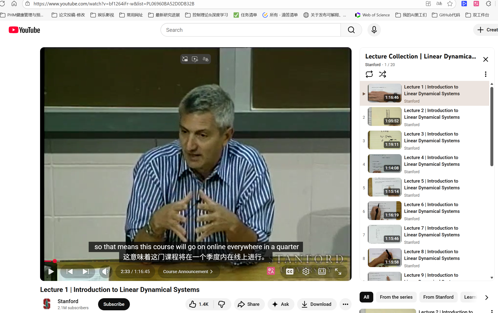

# 博士论文学习资源

在gemini中pin了

斯坦福的课程https://youtu.be/bf1264iFr-w?si=s8n5sW1xGf5aFOjK

B站搬运斯坦福：【斯坦福 线性动力系统入门 (Stanford EE263, Introduction to Linear Dynamical Systems)【英】】 https://www.bilibili.com/video/BV1Ct411e74A/?share_source=copy_web&vd_source=bd31e19725768798743e111f9a0083bd

[EE263: 矩阵方法：奇异值分解 --- EE263: Matrix Methods: Singular Value Decomposition](https://ee263.stanford.edu/)还有一些EE363的讲义

还是凸优化的作者

# 准备看斯坦福了

这是一个非常好的问题。简短的回答是：**是的，你的课题与凸优化（Convex Optimization）的相关性非常强，学习它不仅是“有必要”，而且是深入理解和复现论文算法的“刚需”。**

这篇博士论文《Fault Diagnosis for Uncertain Systems in Closed Loop Applied to Semiconductor Equipment》的核心方法论建立在现代鲁棒控制和优化理论之上。

以下我结合论文具体内容，为你分析为什么凸优化对这个课题如此重要：

### 1. 论文直接使用了基于凸优化的合成方法 (LMI)

论文的 **Chapter 7** 标题直接点明了这一点：*"Direct Shaping of Minimum and Maximum Singular Values: An $H_-/H_\infty$ Synthesis Approach for Fault Diagnosis Filters"*。

* 

  **证据：** 在 **Section 7.5 (Numerical Example)** 中，作者明确写道：“All LMI-related computations are performed with **YALMIP** [162] and solved with **MOSEK** [6].” 1

  

  

* **解释：**

  * **LMI (线性矩阵不等式)** 是凸优化的标准形式之一（属于半定规划 Semidefinite Programming, SDP）。
  * **YALMIP** 和 **MOSEK** 是解决凸优化问题的标准工具箱。
  * 如果不理解凸优化，你将无法理解 LMI 是如何被转化为计算机可解的形式，也无法理解为什么要把控制问题转化成 LMI 形式（为了获得全局最优解）。

### 2. 鲁棒控制的核心算法依赖优化

论文的 **Part II (Fault Diagnosis for Uncertain Systems)** 2 重点讨论了在不确定性下的故障诊断。

* 

  **$\mu$-synthesis (μ综合):** 论文多次提到使用了 $\mu$-synthesis 和 D-K iteration（例如 Chapter 4）。虽然 D-K 迭代本身是非凸的，但其中的每一步（D-step 和 K-step）通常都涉及凸优化或近似凸优化求解 3。

  

  

* 

  **最坏情况分析 (Worst-case Analysis):** 论文中提到通过非线性优化计算最坏情况下的增益 4。理解优化的对偶性（Duality）对于理解“最坏情况”和“鲁棒性”之间的数学等价关系非常有帮助。

  

  

### 3. 系统辨识 (System Identification)

论文的 **Part IV** 5 涉及系统辨识（例如递归辨识 RSRIVC）。

* **最小二乘法 (Least Squares):** 这是最基础的凸优化问题。
* **参数估计:** 许多现代辨识算法本质上是在寻找一个参数集，使得预测误差的某种范数（Norm）最小化。理解凸优化能帮助你设计更好的代价函数（Cost Function）或正则化项（Regularization），以处理过拟合或稀疏性问题。

### 4. 解决 $H_-/H_\infty$ 多目标权衡

故障诊断的核心难点在于权衡：**对故障敏感 ($H_-$ 范数大)** 同时 **对干扰不敏感 ($H_\infty$ 范数小)**。

* 这是一个典型的多目标优化问题。论文 Chapter 7 提出了一种基于 **BMI (双线性矩阵不等式)** 的迭代方法 6666。

  

  

* 虽然 BMI 是非凸的，但求解它的主流方法（如论文中使用的）通常是将其松弛为一系列 LMI 问题（凸问题）进行迭代求解。不懂凸优化，你将无法理解这种“松弛”及“迭代”的数学逻辑。

------

### 针对你课题的学习建议

既然你的课题是基于这就这篇论文，建议你在学习 Boyd 的课程时，特别关注以下章节（以 Boyd 《Convex Optimization》教材为例）：

1. **Semidefinite Programming (SDP) & LMIs:** 这是重中之重。你需要熟练掌握如何将控制问题（如稳定性判据、性能指标）写成 LMI 形式。
2. **Norm Approximation:** 理解 $H_2$ 和 $H_\infty$ 范数在优化中的几何意义。
3. **Duality (对偶性):** 对于理解鲁棒控制中的“不确定性界”非常重要。

总结：

这篇论文是**“现代控制理论 + 凸优化”**的典型结合。如果你只懂经典的频域控制（波特图、奈奎斯特图），阅读这篇论文的后半部分（特别是 Chapter 4, 7）会非常吃力。掌握凸优化将是你复现论文结果、甚至改进算法（例如改进 Chapter 7 的迭代速度或收敛性）的关键武器。

【【线性系统-已完结】瑞典皇家理工学院教授胡晓明课程】 https://www.bilibili.com/video/BV1qK411H7ja/?share_source=copy_web&vd_source=bd31e19725768798743e111f9a0083bd

# 我课题的基础

这是一个极具挑战性的前沿课题，若要在此基础上改进，你需要在**现代控制理论**、**凸优化**和**系统辨识**这三大支柱上打下极深的基础。

以下是为你精选的课程和讲义推荐，它们分别对应了论文中的核心技术栈：

### 1. 凸优化与计算基础 (最核心的“算力”来源)

论文中所有关于 $H_-/H_\infty$ 滤波器的设计最终都转化为优化问题（LMI, BMI）求解。

* **核心课程：Convex Optimization I & II (EE364a/b)**
  * **机构：** Stanford University
  * **讲师：** Stephen Boyd (凸优化领域的泰斗)
  * **推荐理由：** 论文中大量使用的 LMI（线性矩阵不等式）和半定规划（SDP）是这门课的重点。Boyd 的讲义非常强调工程应用，能教你如何把控制问题“翻译”成优化求解器（如 CVX, YALMIP）能听懂的语言。
  * **资源链接：** [EE364a 课程主页](https://ee364a.stanford.edu/) (含视频和讲义)
  * [EE364a: Convex Optimization I](https://web.stanford.edu/class/ee364a/)

### 2. 鲁棒控制理论 (论文的理论框架)

论文的核心是处理“不确定性（Uncertainty）”下的故障诊断，这完全属于鲁棒控制的范畴。

* **核心教材：\*Robust and Optimal Control\***
  * **作者：** Kemin Zhou, John Doyle, Keith Glover
  * **推荐理由：** 这本书是鲁棒控制领域的“圣经”，也是你这篇博士论文的主要引用来源之一。你需要精读以下章节：
    * **Uncertainty Modeling:** 如何用 LFT（线性分式变换）对不确定性建模。
    * **$H_\infty$ Control:** 理解 $H_\infty$ 范数作为“最坏情况增益”的物理意义。
    * **$\mu$-Synthesis (结构化奇异值):** 论文 Chapter 4 和 7 明确使用了 $\mu$ 综合来降低保守性，这是高阶内容，必须啃下来。
  * **资源提示：** 路易斯安那州立大学（LSU）Kemin Zhou 教授的主页上有相关补充资料。
* **推荐讲义：Essentials of Robust Control**
  * **作者：** Kemin Zhou
  * **特点：** 相比上一本“大部头”，这本更精简，适合作为入门过渡，快速掌握 D-K 迭代等核心算法流程。

### 3. 系统辨识 (Part IV 的核心)

论文后半部分涉及从数据中提取模型（特别是频域方法和闭环辨识）。

* **核心流派：频域系统辨识 (Frequency Domain Identification)**
  * **关键人物：** Rik Pintelon & Johan Schoukens (Vrije Universiteit Brussel)
  * **推荐教材/方向：** *System Identification: A Frequency Domain Approach*。
  * **推荐理由：** 论文作者所在的 TU Eindhoven 课题组（Tom Oomen 等）深受这个流派影响。论文中提到的 **BLA (Best Linear Approximation)** 和 **Multisine (多正弦激励)** 技术正是该流派的看家本领，专门用于处理非线性系统的线性化建模。
* **基础课程：System Identification**
  * **讲师：** Lennart Ljung (Linköping University)
  * **推荐理由：** 系统辨识领域的奠基人。理解“预测误差方法 (PEM)”和“工具变量法 (Instrumental Variable Methods)”——这是论文 Chapter 8 和 9 中递归算法（RSRIVC）的基础。

### 4. 线性系统理论 (入门基石)

如果你对状态空间、零空间（Nullspace）、互质分解（Coprime Factorization）还不熟练，必须先补这门课。

* **核心课程：Introduction to Linear Dynamical Systems (EE263)**
  * **机构：** Stanford University
  * **讲师：** Stephen Boyd
  * **推荐理由：** 论文 Chapter 6 直接使用了基于 Nullspace 的故障检测方法。这门课会让你对 SVD、最小二乘和线性系统的几何解释有直观的理解，是阅读论文的“识字课”。
  * **资源链接：** [EE263 课程主页](https://ee263.stanford.edu/)

### 总结：你的学习路径建议

1. **速成阶段：** 先看 **EE263 (线性系统)**，确保能看懂论文里的矩阵推导。
2. **攻坚阶段：** 重点钻研 **EE364a (凸优化)** 和 **Zhou 的鲁棒控制教材**。这是你复现论文 Chapter 7（基于 LMI 的滤波器设计）和 Chapter 4（$\mu$ 综合）的前提。
3. **扩展阶段：** 阅读 **Pintelon & Schoukens** 关于频域辨识的资料，理解论文 Part IV 是如何从实验数据中获得高精度模型的。